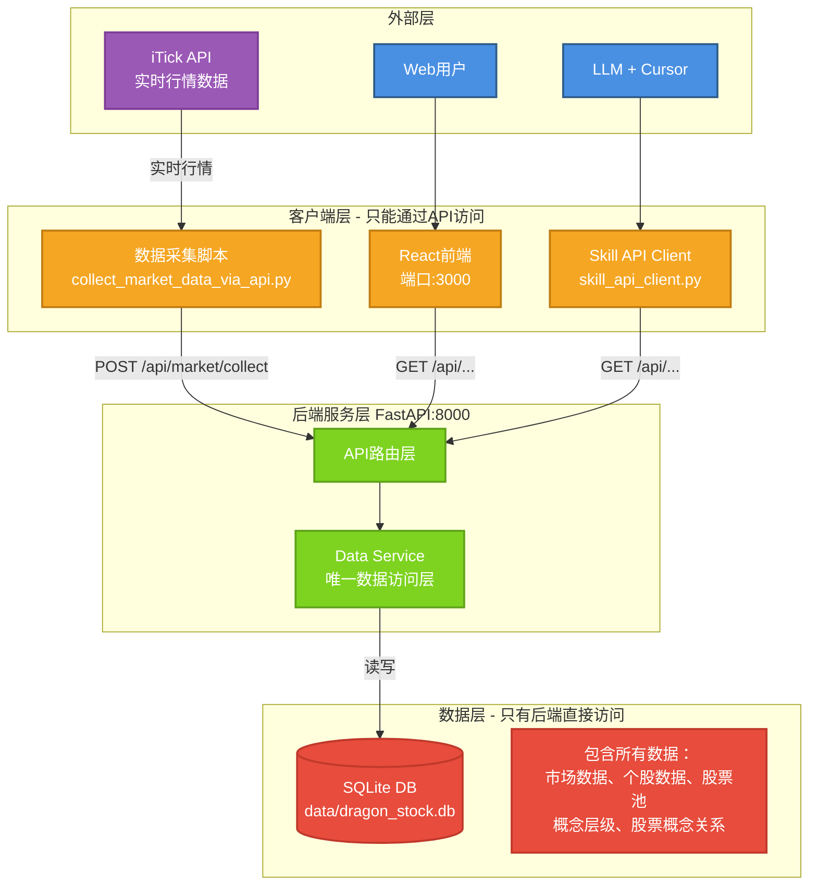

# 龙头战法 Web 平台 - 架构文档

## 系统架构图



## 核心架构原则

### 1. 单一数据源 (Single Source of Truth)
- 所有数据存储在 SQLite 数据库中
- 包括：市场数据、个股数据、股票池配置、概念层级、股票概念关系
- JSON 配置文件仅作为备份，不再被代码直接读取

### 2. API 优先 (API-First)
- 后端是唯一可直接访问数据库的模块
- 所有客户端（前端、Skill、数据采集）通过 HTTP API 访问数据
- 确保数据一致性和访问控制

### 3. 职责清晰 (Clear Responsibility)
- **前端**: UI 展示和用户交互
- **Skill**: LLM 分析和自然语言接口（含数据采集脚本，因为需要 LLM 辅助概念分类）
- **后端**: 唯一数据管理者和业务逻辑层
- **数据层**: 仅被后端直接访问

## 分层架构

### 外部层
- **iTick API**: 提供实时行情数据
- **Web 用户**: 通过浏览器访问
- **LLM 用户**: 通过 Cursor IDE + Skill 访问

### 客户端层
所有客户端只能通过 API 访问数据：

**React 前端** (端口 3000)
- 页面：Dashboard、StockPool、ConceptManage、Analysis
- 通过 Axios 调用后端 API
- 技术栈：React 18 + Ant Design 5

**Skill API Client**
- LLM 通过此客户端访问数据
- 提供自然语言接口
- 位置：`skills/dragon-stock-trading/scripts/skill_api_client.py`

**数据采集脚本**
- 从 iTick API 获取数据
- 通过 `POST /api/market/collect` 写入后端
- 位置：`skills/dragon-stock-trading/scripts/collect_market_data_via_api.py`

### 后端服务层 (FastAPI:8000)

**API 路由层**
```
backend/app/api/
├── market.py      # 市场数据 API
├── stocks.py      # 股票池 API
├── concepts.py    # 概念 API
└── analysis.py    # 分析 API
```

**数据服务层**
```
backend/app/services/
├── data_service.py            # 主数据服务（统一入口）
├── query_service.py           # 查询服务
├── concept_manager.py         # 概念管理
└── stock_concept_manager.py   # 股票概念关系管理
```

### 数据层

**SQLite 数据库** (`data/dragon_stock.db`)

主要表结构：
- `market_sentiment` - 市场情绪数据
- `stock_daily` - 个股日行情
- `stock_info` - 股票基本信息
- `stock_pool` - 股票池配置
- `concept_hierarchy` - 概念层级
- `stock_concept` - 股票概念关系
- `concept_daily` - 概念日统计
- `stock_events` - 异动记录

## 数据流

### 读取流程
```
用户/LLM 请求
    ↓
客户端（前端/Skill）
    ↓
HTTP GET /api/...
    ↓
后端 API Router
    ↓
Data Service
    ↓
Query Service / Concept Manager
    ↓
SQLite DB
    ↓
返回 JSON 数据
```

### 写入流程
```
iTick API
    ↓
数据采集脚本
    ↓
HTTP POST /api/market/collect
    ↓
后端 API Router
    ↓
Data Service
    ↓
save_market_sentiment() / save_stock_daily()
    ↓
SQLite DB
```

## 数据访问规则

| 模块 | 数据库直接访问 | JSON 文件读取 | API 访问 |
|------|---------------|--------------|---------|
| **后端 DataService** | ✅ 读写 | ❌ | - |
| **前端 React** | ❌ | ❌ | ✅ GET |
| **Skill API Client** | ❌ | ❌ | ✅ GET |
| **数据采集脚本** | ❌ | ❌ | ✅ POST |

## 目录结构详解

```
stock/
├── backend/                    # 后端服务
│   ├── app/
│   │   ├── api/               # API 端点
│   │   │   ├── market.py      # 市场数据 API
│   │   │   ├── stocks.py      # 股票池 API
│   │   │   ├── concepts.py    # 概念 API
│   │   │   └── analysis.py    # 分析 API
│   │   ├── services/          # 业务逻辑 + 数据访问
│   │   │   ├── data_service.py           # 主数据服务
│   │   │   ├── query_service.py          # 查询服务
│   │   │   ├── concept_manager.py        # 概念管理
│   │   │   └── stock_concept_manager.py  # 股票概念关系
│   │   └── models/            # 数据模型
│   │       └── requests.py    # API 请求模型
│   ├── scripts/               # 数据库管理脚本
│   │   ├── db_init.py         # 数据库初始化
│   │   └── migrate_json_to_db.py  # 数据迁移
│   └── requirements.txt       # Python 依赖
│
├── frontend/                  # 前端应用
│   ├── src/
│   │   ├── pages/            # 页面组件
│   │   │   ├── Dashboard.js   # 市场概览
│   │   │   ├── StockPool.js   # 股票池管理
│   │   │   ├── ConceptManage.js  # 概念管理
│   │   │   └── Analysis.js    # 龙头分析
│   │   ├── services/
│   │   │   └── api.js        # API 封装
│   │   └── App.js            # 主应用
│   └── package.json          # npm 依赖
│
├── skills/                   # LLM Skill
│   └── dragon-stock-trading/
│       ├── SKILL.md          # Skill 使用文档
│       ├── scripts/
│       │   ├── skill_api_client.py        # Skill API 客户端
│       │   ├── backend_api_client.py      # 后端 API 客户端
│       │   ├── collect_market_data_via_api.py  # 数据采集
│       │   ├── itick_client.py            # iTick API 客户端
│       │   └── config_loader.py           # 配置加载
│       └── reference/        # 参考文档
│           ├── 龙头战法理论.md
│           ├── 数据库设计.md (已移至 backend/)
│
├── data/                     # 数据目录
│   ├── dragon_stock.db      # SQLite 数据库（主数据源）
│   ├── stock_list.json      # 股票池备份
│   ├── concepts.json        # 概念配置备份
│   └── config.yaml          # 系统配置
│
└── logs/                    # 日志目录
    ├── backend.log
    └── frontend.log
```

## API 端点

### 市场数据 API

```
GET  /api/market/sentiment         # 获取今日市场情绪
GET  /api/market/sentiment/{date}  # 获取指定日期市场情绪
POST /api/market/collect           # 采集市场数据（供数据采集脚本调用）
```

### 股票池 API

```
GET    /api/stocks                    # 获取股票池
POST   /api/stocks                    # 添加股票到池
DELETE /api/stocks/{code}             # 从池中移除股票
GET    /api/stocks/{code}/detail      # 获取股票详情
GET    /api/stocks/popularity/{date}  # 获取人气榜
```

### 概念 API

```
GET  /api/concepts                      # 获取概念层级
POST /api/concepts                      # 创建新概念
GET  /api/concepts/{name}/stocks        # 获取概念下的股票
POST /api/concepts/{name}/stocks        # 添加股票到概念
GET  /api/concepts/{name}/analysis      # 概念分析
```

### 分析 API

```
POST /api/analysis/stock    # 分析个股
POST /api/analysis/concept  # 分析概念
```

## 技术选型

### 后端
- **FastAPI**: 现代、高性能的 Python Web 框架
- **SQLite**: 轻量级关系型数据库，适合单机部署
- **Pydantic**: 数据验证和设置管理
- **uvicorn**: ASGI 服务器

### 前端
- **React 18**: 用户界面库
- **Ant Design 5**: 企业级 UI 组件库
- **Axios**: HTTP 客户端
- **React Router 6**: 前端路由

### 数据源
- **iTick API**: 实时行情数据接口

## 部署架构

### 开发环境
```
localhost:8000  →  后端 (FastAPI)
localhost:3000  →  前端 (React Dev Server)
```

### 生产环境建议
```
nginx (443) → FastAPI (8000)
            → React (静态文件)
PostgreSQL (替代 SQLite)
```

## 扩展性

### 水平扩展
- 前端：静态文件，可用 CDN
- 后端：无状态，可多实例部署
- 数据库：可迁移到 PostgreSQL

### 功能扩展
- 添加用户认证
- 实现 WebSocket 实时推送
- 添加策略回测功能
- 集成更多数据源

## 安全考虑

### 当前（开发环境）
- 无认证机制
- SQLite 本地存储
- CORS 允许 localhost:3000

### 生产环境建议
- 添加 JWT 认证
- API 频率限制
- HTTPS 加密
- PostgreSQL + SSL
- 日志审计

## 性能优化

### 已实施
- SQLite 索引优化
- API 响应缓存（DataService 单例）

### 可优化
- Redis 缓存层
- 数据库连接池
- API 响应压缩
- 前端代码分割

## 监控与日志

### 日志位置
```
logs/backend.log   # 后端日志
logs/frontend.log  # 前端日志
```

### 监控指标建议
- API 响应时间
- 数据库查询性能
- 错误率
- 并发用户数

---

**架构版本**: 3.0 (Backend Isolation)  
**更新日期**: 2026-02-26
