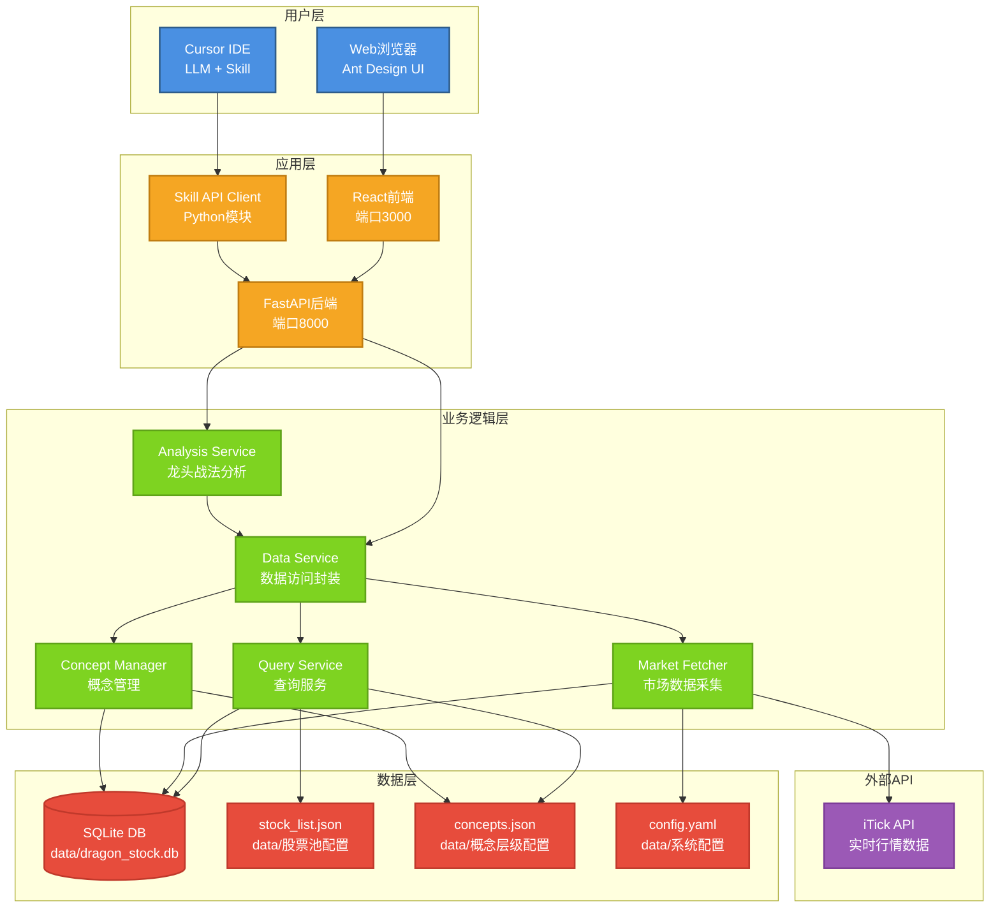
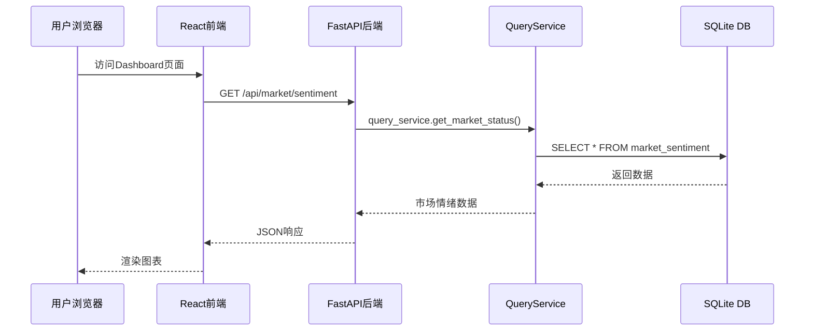
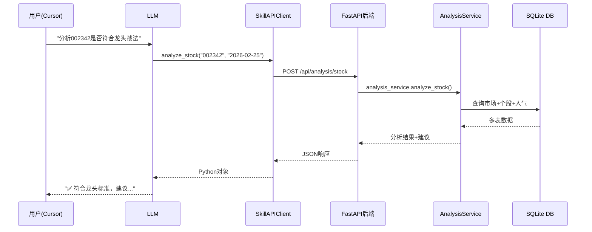
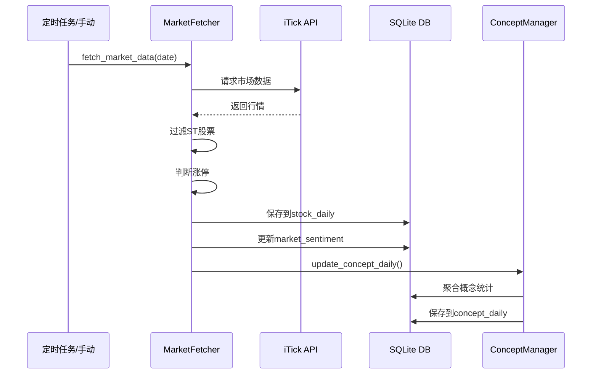

# 龙头战法Web平台 - 项目架构

## 总体架构图



## 分层架构详解

### 1. 用户层 (User Layer)

#### Web用户
- **工具**: 浏览器
- **界面**: React + Ant Design
- **功能**: 
  - 可视化查看市场数据
  - 管理股票池和概念
  - 一键分析龙头

#### AI用户
- **工具**: Cursor IDE + LLM
- **接口**: Skill API Client
- **功能**:
  - 自然语言查询
  - 智能分析建议
  - 自动化决策

---

### 2. 应用层 (Application Layer)

#### React前端 (端口3000)
```
frontend/
├── src/
│   ├── pages/              # 页面组件
│   │   ├── Dashboard/      # 市场总览
│   │   ├── StockPool/      # 股票池管理
│   │   ├── ConceptManage/  # 概念管理
│   │   └── Analysis/       # 龙头分析
│   ├── components/         # 通用组件
│   ├── services/
│   │   └── api.js         # API封装
│   └── App.js             # 主应用
└── package.json
```

**技术栈**:
- React 18
- Ant Design 5
- Axios (HTTP客户端)
- React Router 6

**职责**:
- 用户交互界面
- 数据可视化
- 表单提交和验证

---

#### FastAPI后端 (端口8000)
```
backend/
├── app/
│   ├── api/               # REST API路由
│   │   ├── market.py      # 市场数据API
│   │   ├── stocks.py      # 股票管理API
│   │   ├── concepts.py    # 概念管理API
│   │   └── analysis.py    # 龙头分析API
│   ├── services/          # 业务逻辑
│   │   ├── data_service.py
│   │   └── analysis_service.py
│   ├── models/            # 数据模型
│   └── main.py            # 应用入口
└── requirements.txt
```

**技术栈**:
- FastAPI 0.109
- Uvicorn (ASGI服务器)
- Pydantic (数据验证)

**职责**:
- RESTful API服务
- 请求路由和验证
- CORS跨域处理
- 业务逻辑编排

---

#### Skill API Client
```python
# skills/dragon-stock-trading/scripts/skill_api_client.py

class SkillAPIClient:
    - get_market_sentiment(date)      # 市场情绪
    - get_stock_list()                # 股票列表
    - get_concepts()                  # 概念树
    - analyze_stock(code, date)       # 龙头分析
    - get_popularity_rank(date, limit) # 人气榜
    # ... 更多方法
```

**职责**:
- 封装HTTP请求
- 提供简洁的Python接口
- 供LLM Skill调用

---

### 3. 业务逻辑层 (Business Logic Layer)

#### Analysis Service (龙头战法分析)
```python
class AnalysisService:
    def analyze_stock(code, date):
        # 1. 获取市场情绪（冰点/主升/正常）
        # 2. 获取个股信息（价格、成交额、概念）
        # 3. 计算人气排名（成交额前30）
        # 4. 判断龙头标准
        #    - 人气底线：进入前30
        #    - 逻辑正宗：有核心概念
        #    - 涨幅突出：涨幅>3%
        # 5. 生成操作建议
        return analysis_result
```

**判断标准**:
- ✅ 人气底线: 成交额排名前30
- ✅ 逻辑正宗: 有核心概念归属
- ✅ 涨幅突出: 涨幅 > 3%
- ✅ 市场适配: 根据冰点/主升给出策略

---

#### Data Service (数据访问封装)
```python
class DataService:
    - query_service       # 查询服务
    - market_fetcher      # 市场数据采集
    - concept_manager     # 概念管理
    - stock_concept_manager # 股票概念关系
```

**职责**:
- 统一数据访问入口
- 封装底层脚本模块
- 提供单例服务

---

#### Query Service (查询服务)
```python
class QueryService:
    - get_market_status(date)              # 市场情绪
    - get_stock_with_concept(code, date)   # 个股+概念
    - get_stock_popularity_rank(date, n)   # 人气榜
    - get_concept_leaders(date, min)       # 概念龙头
    - get_concept_analysis(concept, date)  # 概念分析
```

**职责**:
- SQL查询封装
- 数据聚合和计算
- 结果格式化

---

#### Market Fetcher (市场数据采集)
```python
class MarketDataFetcher:
    - fetch_market_data(date)     # 采集市场数据
    - fetch_stock_daily(code)     # 采集个股日线
    - is_limit_up(change, board)  # 涨停判断
```

**职责**:
- 调用iTick API
- 数据采集和存储
- ST股票过滤

---

#### Concept Manager (概念管理)
```python
class ConceptManager:
    - load_concept_config()        # 加载concepts.json
    - get_concept_stats(name, date) # 概念统计
    - update_concept_daily(date)   # 更新概念日线
```

**职责**:
- 概念配置管理
- 概念统计计算
- 股票-概念关系维护

---

### 4. 数据层 (Data Layer)

#### SQLite数据库 (data/dragon_stock.db)

**表结构**:

```sql
-- 1. 市场情绪表
CREATE TABLE market_sentiment (
    date TEXT PRIMARY KEY,
    limit_up_count INTEGER,      -- 涨停家数
    limit_down_count INTEGER,    -- 跌停家数
    max_streak INTEGER,          -- 最高连板
    market_phase TEXT            -- 市场阶段
);

-- 2. 个股日线表
CREATE TABLE stock_daily (
    id INTEGER PRIMARY KEY,
    stock_code TEXT,
    trade_date TEXT,
    open_price REAL,
    close_price REAL,
    high_price REAL,
    low_price REAL,
    change_percent REAL,         -- 涨跌幅
    turnover REAL,               -- 成交额
    is_limit_up INTEGER,         -- 是否涨停
    UNIQUE(stock_code, trade_date)
);

-- 3. 股票基本信息表
CREATE TABLE stock_info (
    stock_code TEXT PRIMARY KEY,
    stock_name TEXT,
    market TEXT,                 -- SZ/SH
    industry TEXT
);

-- 4. 股票-概念关系表
CREATE TABLE stock_concept (
    id INTEGER PRIMARY KEY,
    stock_code TEXT,
    concept_name TEXT,
    is_core INTEGER,             -- 是否核心标的
    note TEXT,
    UNIQUE(stock_code, concept_name)
);

-- 5. 概念日线表
CREATE TABLE concept_daily (
    id INTEGER PRIMARY KEY,
    concept_name TEXT,
    trade_date TEXT,
    limit_up_count INTEGER,      -- 涨停家数
    avg_change REAL,             -- 平均涨幅
    total_turnover REAL,         -- 总成交额
    leader_code TEXT,            -- 领涨股
    UNIQUE(concept_name, trade_date)
);

-- 6. 股票事件表
CREATE TABLE stock_events (
    id INTEGER PRIMARY KEY,
    stock_code TEXT,
    event_date TEXT,
    event_type TEXT,             -- limit_up/announcement
    description TEXT
);
```

**数据量**:
- stock_concept: 117条关系
- stock_daily: 动态增长
- market_sentiment: 按日期

---

#### JSON配置文件

所有配置文件统一放在 `data/` 目录：

**data/stock_list.json** (149只股票)
```json
{
  "description": "龙头战法关注股票池",
  "update_date": "2026-02-25",
  "stocks": [
    {"code": "002342", "name": "巨力索具", "market": "SZ"},
    {"code": "002025", "name": "航天电器", "market": "SZ"},
    // ... 147只
  ]
}
```

**data/concepts.json** (9大类概念)
```json
{
  "商业航天": {
    "description": "商业航天产业链：火箭发射、卫星制造、地面设备",
    "subconcepts": {
      "卫星制造": {"description": "卫星设计、制造、总装（产业链核心环节）"},
      "火箭发射": {"description": "火箭发动机、发射服务（产业链上游核心）"},
      // ... 4个细分
    }
  },
  "化工": { /* 2个细分 */ },
  "有色金属": { /* 5个细分 */ },
  "新能源": { /* 4个细分 */ },
  "AI应用": { /* 5个细分 */ },
  "存储芯片": { /* 3个细分 */ },
  "半导体": { /* 5个细分 */ },
  "AI硬件": { /* 3个细分 */ },
  "机器人": { /* 4个细分 */ }
}
```

**data/config.yaml** (系统配置)
```yaml
itick:
  api_key: "your_key"
  base_url: "https://api.itick.io"
  timeout: 10

limit_up:
  main_board: 0.099      # 主板10%
  growth_board: 0.199    # 创业板20%
  st_stock: 0.049        # ST股5%
```

---

### 数据访问规则 🔒

#### 唯一数据入口：后端
```
✅ backend/ → 直接访问 data/
❌ frontend/ → 只能通过API访问
❌ skills/ → 只能通过API Client访问（skill_api_client.py）
```

#### 例外：数据采集脚本
```
✅ skills/scripts/market_fetcher.py → 可直接写入 data/dragon_stock.db
✅ skills/scripts/history_sync.py → 可直接写入 data/dragon_stock.db
```

**原因**：数据采集脚本需要批量写入，不适合通过API

#### iTick API
- **功能**: 实时行情数据
- **接口**: 
  - `/stock/quote` - 实时行情
  - `/stock/kline` - K线数据
- **限制**: 需要API Key

---

## 数据流图

### 场景1：Web用户查看市场总览



---

### 场景2：LLM分析股票



---

### 场景3：数据采集流程



---

## 技术栈总览

| 层级 | 技术 | 版本 | 用途 |
|-----|------|------|------|
| **前端** | React | 18.2 | UI框架 |
| | Ant Design | 5.12 | UI组件库 |
| | Axios | 1.6 | HTTP客户端 |
| | React Router | 6.20 | 路由管理 |
| | ECharts | 5.4 | 图表可视化 |
| **后端** | FastAPI | 0.109 | Web框架 |
| | Uvicorn | 0.27 | ASGI服务器 |
| | Pydantic | 2.5 | 数据验证 |
| **数据** | SQLite | 3.x | 数据库 |
| | Requests | 2.31 | HTTP客户端 |
| **外部** | iTick API | - | 行情数据源 |

---

## 部署架构

### 本地开发环境 (当前)
```
┌─────────────────────────────────────┐
│     Localhost (MacOS)               │
│                                     │
│  ┌──────────┐      ┌──────────┐   │
│  │ Frontend │      │ Backend  │   │
│  │  :3000   │◄────►│  :8000   │   │
│  └──────────┘      └────┬─────┘   │
│                          │          │
│                    ┌─────▼─────┐   │
│                    │  SQLite   │   │
│                    │  Database │   │
│                    └───────────┘   │
│                                     │
│  ┌──────────────────────────────┐  │
│  │   Cursor IDE (LLM + Skill)   │  │
│  └──────────────┬───────────────┘  │
│                 │                   │
│         SkillAPIClient             │
│                 │                   │
└─────────────────┼───────────────────┘
                  │
                  ▼
           iTick API (外部)
```

---

## 关键设计决策

### 1. 为什么选择前后端分离？
✅ **优势**:
- Web界面和Skill可独立使用
- 前端可自由升级UI/UX
- 后端API可被多个客户端调用
- 开发和测试更灵活

### 2. 为什么复用scripts模块？
✅ **优势**:
- 避免代码重复
- 逻辑保持一致
- 维护成本低
- 已有测试覆盖

### 3. 为什么使用SQLite？
✅ **优势**:
- 零配置，开箱即用
- 单文件，便于备份
- 性能足够（个人使用）
- 无需额外数据库服务

### 4. 为什么JSON配置文件？
✅ **优势**:
- stock_list.json: 手动精选，不需要全市场
- concepts.json: 层级清晰，易于可视化
- config.yaml: 集中配置，便于管理

---

## 扩展性设计

### 可扩展点

1. **新增概念**
   - 修改 `concepts.json`
   - 在Web界面中添加股票关系

2. **新增API端点**
   - 在 `backend/app/api/` 添加新路由
   - 自动集成到 Swagger 文档

3. **新增前端页面**
   - 在 `frontend/src/pages/` 添加组件
   - 在 App.js 注册路由

4. **数据导出**
   - 已有API接口，可轻松导出
   - 可添加 Excel/CSV 导出功能

5. **实时推送**
   - 可升级为 WebSocket
   - 或使用 Server-Sent Events

---

## 性能指标

| 指标 | 当前值 | 目标 |
|-----|-------|------|
| API响应时间 | < 500ms | < 300ms |
| 数据库查询 | < 100ms | < 50ms |
| 前端首屏加载 | 2-3s | < 2s |
| 股票分析 | < 1s | < 500ms |
| 并发支持 | 10 | 50+ |

---

## 安全考虑

### 当前实现
- ✅ 本地运行，无公网暴露
- ✅ CORS仅允许localhost:3000
- ✅ API Key存储在config.yaml（本地）

### 生产环境建议
- 🔒 添加用户认证（JWT）
- 🔒 HTTPS加密传输
- 🔒 API Key使用环境变量
- 🔒 SQL注入防护（已有：Pydantic）
- 🔒 请求频率限制

---

## 监控和日志

### 当前日志
```
logs/
├── backend.log    # FastAPI运行日志
└── frontend.log   # React编译日志
```

### 可添加
- 访问日志（每个API请求）
- 错误日志（异常追踪）
- 性能日志（慢查询）
- 用户行为日志

---

## 总结

这是一个**轻量级、高度集成**的股票分析系统：

✅ **轻量级**: SQLite + 本地运行，无需复杂部署  
✅ **高度集成**: 前端、后端、Skill三位一体  
✅ **易扩展**: 清晰的分层架构，模块化设计  
✅ **实用性**: 针对龙头战法，功能精准聚焦  

**适用场景**:
- 个人股票研究
- 龙头战法实战
- AI辅助决策
- 数据可视化分析
