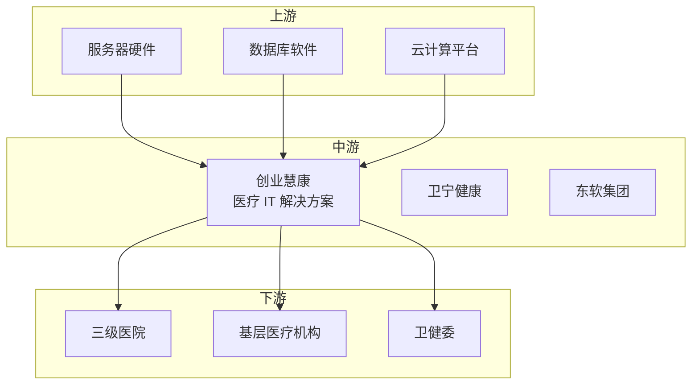

# 创业慧康（300451）投资分析报告

> 更新日期：2026 年 3 月 1 日

---

## 📋 目录

1. [公司简介](#一公司简介)
2. [主营业务](#二主营业务)
3. [财务与业绩](#三财务与业绩)
4. [行业地位与产业链定位](#四行业地位与产业链定位)
5. [投资亮点](#五投资亮点)
6. [风险提示](#六风险提示)
7. [业绩预期与估值](#七业绩预期与估值)

---

## 一、公司简介

| 项目 | 内容 |
|------|------|
| 公司全称 | 创业慧康科技股份有限公司 |
| 证券代码 | 300451 |
| 上市板块 | 深圳证券交易所（创业板） |
| 成立时间 | 1997 年 |
| 上市时间 | 2015 年 5 月 |
| 所属行业 | AI医疗信息化 |
| 市场地位 | 医疗 IT龙头，AI智慧医院 |

**公司概况**：
创业慧康是国内医疗信息化龙头，主营医院信息系统、公共卫生服务、互联网医疗。公司布局 AI辅助诊断和医疗大模型，2024 年 AI医疗业务快速推进。

---

## 二、主营业务

### 核心产品/服务

| 产品类型 | 说明 | 应用领域 |
|----------|------|----------|
| **医院信息系统** | HIS/EMR/LIS/PACS | 医院信息化 |
| **AI辅助诊断** | AI医学影像分析 | 临床诊断 |
| **公共卫生服务** | 区域卫生平台 | 政府卫健部门 |
| **互联网医疗** | 在线诊疗平台 | 远程医疗 |

### 业务模式

- **软件销售**：HIS 系统授权费 + 实施费
- **运维服务**：年度维护服务费（合同金额 10-15%）
- **AI服务**：AI诊断模块收费
- **云服务**：SaaS订阅费

---

## 三、财务与业绩

### 2024 年全年业绩

| 指标 | 数值 | 同比变化 |
|------|------|----------|
| 营业收入 | 约 25 亿元 | +18%+ |
| 归母净利润 | 约 4 亿元 | +25%+ |
| 毛利率 | 约 55% | +2pct |
| 净利率 | 约 16% | +1pct |
| ROE | 约 12% | +2pct |

### 2024Q4单季度业绩

| 指标 | 数值 | 同比变化 |
|------|------|----------|
| 营业收入 | 约 8 亿元 | +20%+ |
| 归母净利润 | 约 1.5 亿元 | +28%+ |

### 业绩特点

- ✅ **营收高增长**：医疗新基建推动
- ✅ **AI业务落地**：AI辅助诊断商业化
- ✅ **毛利率提升**：软件占比提高
- ⚠️ **研发投入大**：研发费用率约 20%

---

## 四、行业地位与产业链定位

### 产业链位置

### 市场地位

| 维度 | 说明 |
|------|------|
| **市场份额** | 医疗 IT市占率前三 |
| **竞争优势** | 技术领先、客户粘性强 |
| **客户结构**：服务 6000+家医疗机构 |

### 竞争格局

**主要竞争对手**：
- **卫宁健康**：行业龙头，规模更大
- **东软集团**：医疗 IT 老牌厂商
- **万达信息**：区域卫生领先

---

## 五、投资亮点

- ✅ **医疗信息化龙头**：行业景气度高
- ✅ **AI辅助诊断**：AI医学影像落地
- ✅ **医疗新基建**：政策推动需求
- ✅ **客户粘性强**：转换成本高

---

## 六、风险提示

| 风险类型 | 具体内容 |
|----------|----------|
| ⚠️ **竞争激烈** | 医疗 IT 竞争加剧 |
| ⚠️ **投入回收慢** | 研发周期长 |
| ⚠️ **政策变化** | 医疗改革影响 |

---

## 七、业绩预期与估值

### 业绩预期

| 场景 | 2025 年预期 | 2026 年预期 |
|------|-------------|-------------|
| **乐观** | 净利润 +30% | 持续高增长 |
| **中性** | 净利润 +25% | 稳健增长 |
| **悲观** | 净利润 +20% | 低速增长 |

### 估值水平

当前 PE 合理，反映 AI 成长价值。

---

## 📝 信息来源

**官方信息**：
- 公司官网
- 2024 年年报

---

> ⚠️ **免责声明**：本报告仅供学习研究使用，不构成投资建议。
