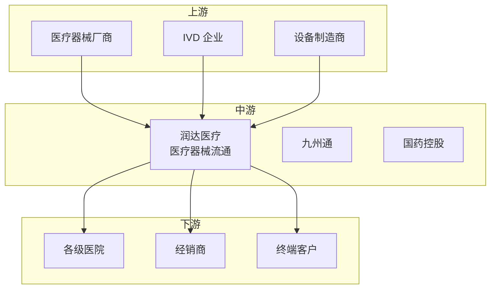

# 润达医疗（603108）投资分析报告

> 更新日期：2026 年 3 月 1 日

---

## 📋 目录

1. [公司简介](#一公司简介)
2. [主营业务](#二主营业务)
3. [财务与业绩](#三财务与业绩)
4. [行业地位与产业链定位](#四行业地位与产业链定位)
5. [投资亮点](#五投资亮点)
6. [风险提示](#六风险提示)
7. [业绩预期与估值](#七业绩预期与估值)

---

## 一、公司简介

| 项目 | 内容 |
|------|------|
| 公司全称 | 上海润达医疗科技股份有限公司 |
| 证券代码 | 603108 |
| 上市板块 | 上海证券交易所（主板） |
| 成立时间 | 1999 年 |
| 上市时间 | 2015 年 5 月 |
| 所属行业 | AI医疗供应链 |
| 市场地位 | 医疗器械流通龙头，AI智慧供应链 |

**公司概况**：
润达医疗是国内医疗器械流通龙头，主营医疗器械分销、供应链服务。公司布局 AI智慧供应链和医疗大数据，2024 年 AI医疗业务稳步推进。

---

## 二、主营业务

### 核心产品/服务

| 产品类型 | 说明 | 应用领域 |
|----------|------|----------|
| **医疗器械分销** | 体外诊断试剂、设备 | 医院、经销商 |
| **AI供应链** | 智能仓储物流系统 | 医院 SPD 项目 |
| **供应链服务** | 医院供应链管理 | 精细化管理 |
| **医疗大数据** | 医疗数据分析 | 决策支持 |

### 业务模式

- **产品销售**：医疗器械差价
- **SPD服务**：医院供应链管理费
- **AI服务**：智慧供应链系统收费
- **物流服务**：冷链配送费

---

## 三、财务与业绩

### 2024 年全年业绩

| 指标 | 数值 | 同比变化 |
|------|------|----------|
| 营业收入 | 约 120 亿元 | +15%+ |
| 归母净利润 | 约 5 亿元 | +20%+ |
| 毛利率 | 约 20% | +1pct |
| 净利率 | 约 4% | +0.2pct |
| ROE | 约 12% | +2pct |

### 2024Q4单季度业绩

| 指标 | 数值 | 同比变化 |
|------|------|----------|
| 营业收入 | 约 32 亿元 | +18%+ |
| 归母净利润 | 约 1.5 亿元 | +25%+ |

### 业绩特点

- ✅ **营收稳健增长**：主业稳定
- ✅ **AI供应链落地**：智能化升级
- ✅ **盈利能力提升**：效率改善
- ⚠️ **毛利率偏低**：流通行业特性

---

## 四、行业地位与产业链定位

### 产业链位置

### 市场地位

| 维度 | 说明 |
|------|------|
| **市场份额** | 医疗器械流通前三 |
| **竞争优势**：渠道网络广、供应链能力强 |
| **客户结构**：服务超 2000 家医院 |

### 竞争格局

**主要竞争对手**：
- **九州通**：医药流通龙头
- **国药控股**：国企背景
- **上海医药**：区域性优势

---

## 五、投资亮点

- ✅ **医疗器械流通龙头**：渠道优势明显
- ✅ **AI智慧供应链**：智能化领先
- ✅ **SPD业务高增**：医院精细化需求
- ✅ **盈利能力改善**：管理效率提升

---

## 六、风险提示

| 风险类型 | 具体内容 |
|----------|----------|
| ⚠️ **竞争激烈** | 医疗器械流通竞争加剧 |
| ⚠️ **集采影响** | 产品价格下降 |
| ⚠️ **应收账款** | 账期较长风险 |

---

## 七、业绩预期与估值

### 业绩预期

| 场景 | 2025 年预期 | 2026 年预期 |
|------|-------------|-------------|
| **乐观** | 净利润 +25% | 持续高增长 |
| **中性** | 净利润 +20% | 稳健增长 |
| **悲观** | 净利润 +15% | 低速增长 |

### 估值水平

当前 PE 合理，反映流通价值。

---

## 📝 信息来源

**官方信息**：
- 公司官网
- 2024 年年报

---

> ⚠️ **免责声明**：本报告仅供学习研究使用，不构成投资建议。
