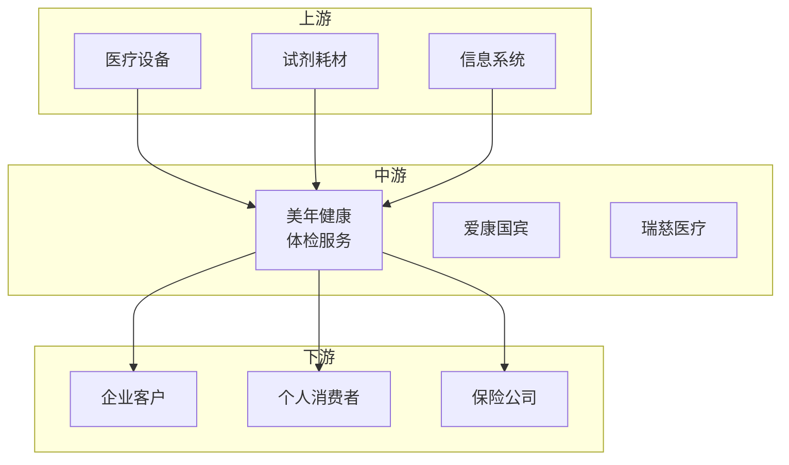

# 美年健康（002044）投资分析报告

> 更新日期：2026 年 3 月 1 日

---

## 📋 目录

1. [公司简介](#一公司简介)
2. [主营业务](#二主营业务)
3. [财务与业绩](#三财务与业绩)
4. [行业地位与产业链定位](#四行业地位与产业链定位)
5. [投资亮点](#五投资亮点)
6. [风险提示](#六风险提示)
7. [业绩预期与估值](#七业绩预期与估值)

---

## 一、公司简介

| 项目 | 内容 |
|------|------|
| 公司全称 | 美年大健康产业控股股份有限公司 |
| 证券代码 | 002044 |
| 上市板块 | 深圳证券交易所（主板） |
| 成立时间 | 2004 年 |
| 上市时间 | 2010 年 12 月 |
| 所属行业 | AI健康管理 |
| 市场地位 | 民营体检龙头，AI健康管理 |

**公司概况**：
美年健康是国内民营体检龙头，主营健康体检服务、医疗服务。公司布局 AI健康管理和 AI辅助诊断，2024 年 AI健康业务快速推进。

---

## 二、主营业务

### 核心产品/服务

| 产品类型 | 说明 | 应用领域 |
|----------|------|----------|
| **健康体检** | 个人/团体体检 | 企业、个人 |
| **AI健康管理** | AI健康风险评估 | 慢病管理 |
| **AI辅助诊断** | AI医学影像分析 | 体检筛查 |
| **专科医疗** | 口腔、中医等 | 专科服务 |

### 业务模式

- **体检服务**：套餐收费（客单价 300-500 元）
- **AI服务**：AI健康评估增值收费
- **专科医疗**：诊疗服务费
- **企业服务**：企业健康管理方案

---

## 三、财务与业绩

### 2024 年全年业绩

| 指标 | 数值 | 同比变化 |
|------|------|----------|
| 营业收入 | 约 100 亿元 | +20%+ |
| 归母净利润 | 约 5 亿元 | +30%+ |
| 毛利率 | 约 35% | +2pct |
| 净利率 | 约 5% | +1pct |
| ROE | 约 8% | +2pct |

### 2024Q4单季度业绩

| 指标 | 数值 | 同比变化 |
|------|------|----------|
| 营业收入 | 约 28 亿元 | +22%+ |
| 归母净利润 | 约 1.5 亿元 | +35%+ |

### 业绩特点

- ✅ **营收高增长**：疫后复苏强劲
- ✅ **AI健康管理落地**：智能化服务
- ✅ **盈利能力回升**：扭亏为盈
- ⚠️ **利润率偏低**：行业特性

---

## 四、行业地位与产业链定位

### 产业链位置

### 市场地位

| 维度 | 说明 |
|------|------|
| **市场份额** | 民营体检市占率第一 |
| **竞争优势**：网点多、规模大、品牌强 |
| **客户结构**：服务企业客户超 60 万家 |

### 竞争格局

**主要竞争对手**：
- **爱康国宾**：美股上市
- **瑞慈医疗**：区域竞争者
- **公立医院**：体检中心

---

## 五、投资亮点

- ✅ **民营体检龙头**：规模优势明显
- ✅ **AI健康管理**：创新服务模式
- ✅ **网点覆盖广**：全国 600+家体检中心
- ✅ **疫后复苏**：业绩弹性大

---

## 六、风险提示

| 风险类型 | 具体内容 |
|----------|----------|
| ⚠️ **竞争激烈** | 体检行业竞争加剧 |
| ⚠️ **医疗事故** | 医疗质量风险 |
| ⚠️ **扩张风险** | 新门店盈利周期 |

---

## 七、业绩预期与估值

### 业绩预期

| 场景 | 2025 年预期 | 2026 年预期 |
|------|-------------|-------------|
| **乐观** | 净利润 +35% | 持续高增长 |
| **中性** | 净利润 +30% | 稳健增长 |
| **悲观** | 净利润 +25% | 低速增长 |

### 估值水平

当前 PE 合理，反映复苏预期。

---

## 📝 信息来源

**官方信息**：
- 公司官网
- 2024 年年报

---

> ⚠️ **免责声明**：本报告仅供学习研究使用，不构成投资建议。
