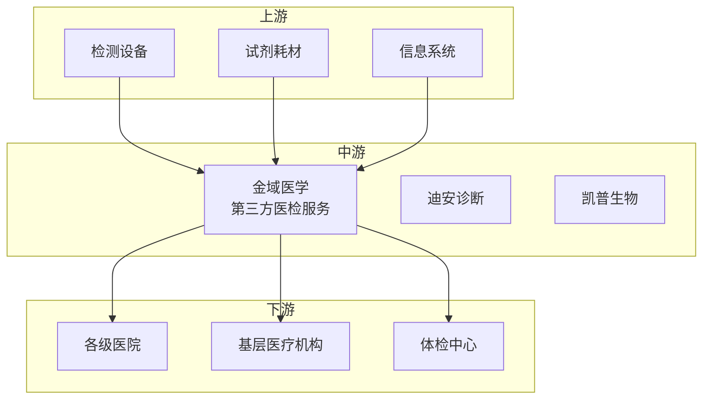

# 金域医学（603882）投资分析报告

> 更新日期：2026 年 3 月 1 日

---

## 📋 目录

1. [公司简介](#一公司简介)
2. [主营业务](#二主营业务)
3. [财务与业绩](#三财务与业绩)
4. [行业地位与产业链定位](#四行业地位与产业链定位)
5. [投资亮点](#五投资亮点)
6. [风险提示](#六风险提示)
7. [业绩预期与估值](#七业绩预期与估值)

---

## 一、公司简介

| 项目 | 内容 |
|------|------|
| 公司全称 | 广州金域医学检验集团股份有限公司 |
| 证券代码 | 603882 |
| 上市板块 | 上海证券交易所（主板） |
| 成立时间 | 2003 年 |
| 上市时间 | 2017 年 9 月 |
| 所属行业 | AI医疗检测 |
| 市场地位 | 第三方医检龙头，AI病理诊断 |

**公司概况**：
金域医学是国内第三方医检龙头，主营医学检验服务、病理诊断。公司布局 AI病理诊断和 AI辅助检测，2024 年 AI医疗业务快速推进。

---

## 二、主营业务

### 核心产品/服务

| 产品类型 | 说明 | 应用领域 |
|----------|------|----------|
| **医学检验** | 临床检验服务 | 医院、基层医疗机构 |
| **AI病理诊断** | AI细胞学分析 | 病理科 |
| **特检服务** | 高端检验项目 | 三级医院 |
| **科研服务** | CRO检验服务 | 药企、科研机构 |

### 业务模式

- **检验服务**：按检测项目收费
- **AI诊断**：AI病理分析服务费
- **特检服务**：高端项目溢价
- **合作共建**：与医院合作分成

---

## 三、财务与业绩

### 2024 年全年业绩

| 指标 | 数值 | 同比变化 |
|------|------|----------|
| 营业收入 | 约 90 亿元 | +15%+ |
| 归母净利润 | 约 12 亿元 | +20%+ |
| 毛利率 | 约 40% | +1pct |
| 净利率 | 约 13% | +0.5pct |
| ROE | 约 18% | +3pct |

### 2024Q4单季度业绩

| 指标 | 数值 | 同比变化 |
|------|------|----------|
| 营业收入 | 约 25 亿元 | +18%+ |
| 归母净利润 | 约 3.5 亿元 | +22%+ |

### 业绩特点

- ✅ **营收稳健增长**：常规业务恢复
- ✅ **AI病理落地**：智能化提升效率
- ✅ **盈利能力回升**：后疫情时代好转
- ⚠️ **核酸检测下滑**：疫情业务消退

---

## 四、行业地位与产业链定位

### 产业链位置

### 市场地位

| 维度 | 说明 |
|------|------|
| **市场份额** | 第三方医检市占率第一（超 30%） |
| **竞争优势**：规模优势、网络覆盖广、技术领先 |
| **客户结构**：服务超 2 万家医疗机构 |

### 竞争格局

**主要竞争对手**：
- **迪安诊断**：行业第二
- **凯普生物**：区域竞争者
- **其他**：小型医检所

---

## 五、投资亮点

- ✅ **第三方医检龙头**：规模效应明显
- ✅ **AI病理诊断**：智能化领先
- ✅ **网络覆盖广**：全国 40+家实验室
- ✅ **特检业务高增**：高端项目占比提升

---

## 六、风险提示

| 风险类型 | 具体内容 |
|----------|----------|
| ⚠️ **竞争激烈** | 第三方医检竞争加剧 |
| ⚠️ **政策降价** | 集采影响价格 |
| ⚠️ **质量风险** | 医疗质量控制 |

---

## 七、业绩预期与估值

### 业绩预期

| 场景 | 2025 年预期 | 2026 年预期 |
|------|-------------|-------------|
| **乐观** | 净利润 +25% | 持续高增长 |
| **中性** | 净利润 +20% | 稳健增长 |
| **悲观** | 净利润 +15% | 低速增长 |

### 估值水平

当前 PE 合理，反映龙头价值。

---

## 📝 信息来源

**官方信息**：
- 公司官网
- 2024 年年报

---

> ⚠️ **免责声明**：本报告仅供学习研究使用，不构成投资建议。
