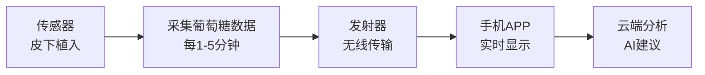
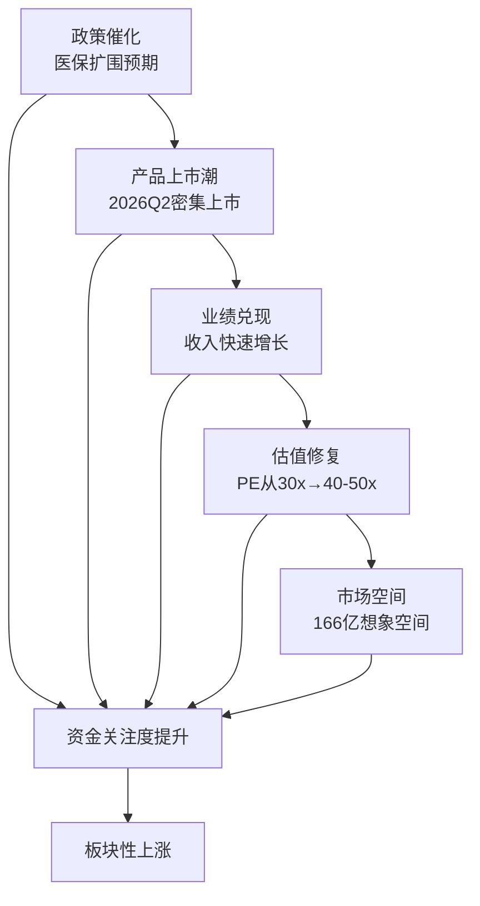

# CGM持续血糖监测板块深度分析

> 更新日期：2026年3月12日  
> 核心观点：这是一个**确定性的板块性机会**

---

## 📋 目录

1. [CGM是什么](#一cgm是什么)
2. [市场规模与增速](#二市场规模与增速)
3. [为什么是板块性机会](#三为什么是板块性机会)
4. [核心上市公司梳理](#四核心上市公司梳理)
5. [投资策略与风险](#五投资策略与风险)

---

## 一、CGM是什么

### 1.1 基本概念

**CGM = Continuous Glucose Monitoring = 持续血糖监测**

这是一种**革命性的血糖监测技术**，与传统血糖仪完全不同：

| 对比维度 | 传统血糖仪（BGM） | 持续血糖监测（CGM） |
|---------|------------------|-------------------|
| **监测方式** | 扎手指采血 | 皮下植入传感器 |
| **监测频率** | 需要时手动测量 | 每1-5分钟自动监测 |
| **痛苦程度** | 每次测量都痛 | 佩戴期间无痛 |
| **数据完整性** | 离散数据点 | 连续曲线 |
| **佩戴周期** | - | 7-16天 |
| **预警功能** | ❌ 无 | ✅ 高低血糖预警 |
| **趋势分析** | ❌ 无 | ✅ 血糖变化趋势 |
| **数据上传** | 需手动记录 | 自动上传APP |

### 1.2 工作原理

### 1.3 核心技术指标

| 指标 | 说明 | 国际标准 | 国产水平 |
|------|------|---------|---------|
| **MARD值** | 平均绝对相对差异（准确度） | <10% | 7.45%-9.8% |
| **传感器寿命** | 单次佩戴时长 | 7-14天 | 14-16天 |
| **校准方式** | 是否需要指血校准 | 免校准 | 多数免校准 |
| **初始化时间** | 佩戴后多久可用 | 1-2小时 | 45分钟-2小时 |
| **重量** | 佩戴舒适度 | <5克 | 2-4克 |

**国产CGM技术已达国际先进水平！**

### 1.4 为什么CGM是革命性产品

#### 医疗价值
1. **全面监测**：24小时连续数据，发现夜间低血糖等隐藏风险
2. **预警保护**：高低血糖提前预警，避免昏迷等危险
3. **精准管理**：了解食物、运动对血糖的影响，优化治疗方案
4. **减少并发症**：通过精准控糖减少糖尿病并发症

#### 用户体验
1. **无痛监测**：告别每天扎手指的痛苦
2. **便捷性**：手机随时查看，不需要携带血糖仪
3. **智能化**：AI分析提供个性化建议
4. **数据共享**：家人可远程关注患者血糖

---

## 二、市场规模与增速

### 2.1 全球市场

| 年份 | 市场规模 | 同比增速 |
|------|---------|---------|
| 2015年 | 17亿美元 | - |
| 2020年 | 57亿美元 | 27%+ |
| 2025年 | 107亿美元 | 15%+ |
| **2030年预测** | **365亿美元** | **28%复合增速** |
| **2032年预测** | **164.74亿元** | **6.35%复合增速** |

**全球CGM市场将在5年内增长3-4倍！**

### 2.2 中国市场

#### 市场规模
| 年份 | 市场规模 | 同比增速 | 渗透率 |
|------|---------|---------|-------|
| 2020年 | 8.9亿元 | - | ~2% |
| 2025年 | 26.94亿元（整体） 15.4亿元（销售额） | **45.8%** | ~5% |
| **2030年预测** | **166亿元** | **44%复合增速** | 15-20% |

#### 增速对比
- **CGM市场增速**：45.8%
- **传统血糖仪市场增速**：10.2%
- **CGM增速是传统血糖仪的4.5倍！**

### 2.3 增长驱动因素

#### 1️⃣ 糖尿病患者基数庞大

| 地区 | 糖尿病患者数 | CGM渗透率 | 潜在用户 |
|------|------------|----------|---------|
| **中国** | 1.4亿人 | 5% | 700万→2800万（20%渗透） |
| **美国** | 3500万人 | 30%+ | - |
| **欧洲** | - | 20%+ | - |

**中国CGM渗透率仅5%，提升空间巨大！**

#### 2️⃣ 政策强力推动

**国家政策**：
- 《健康中国行动——糖尿病防治行动实施方案（2024-2030年）》
- 目标：2030年糖尿病规范管理率达70%+
- 明确鼓励推广CGM应用

**医保覆盖**：
- 已纳入地区：北京、上海、浙江、四川等
- 报销比例：50-80%
- 预期：2026-2027年全国推广

**影响**：医保覆盖将使CGM价格从患者角度下降50%+，极大促进普及

#### 3️⃣ 技术成熟+价格下降

**价格趋势**：
| 时期 | 单个传感器价格 | 年使用成本 |
|------|--------------|-----------|
| 2020年（进口） | 500-800元 | 1.2-2万元 |
| 2025年（国产） | 150-300元 | 3600-7200元 |
| **降幅** | **70%+** | **70%+** |

**国产化使CGM从"奢侈品"变为"可负担产品"**

#### 4️⃣ 应用场景扩大

传统认知：CGM仅用于1型糖尿病  
**新趋势**：
- ✅ 2型糖尿病（1.3亿患者）
- ✅ 妊娠糖尿病（孕妇血糖管理）
- ✅ 糖尿病前期（1.5亿潜在患者）
- ✅ 运动健康人群（运动员、健身爱好者）
- ✅ 减重人群（了解食物对血糖影响）

**潜在用户群从1400万→3亿+**

---

## 三、为什么是板块性机会

### 3.1 核心判断：这是确定性的板块性机会 ✅

#### 判断依据

| 维度 | 判断 | 理由 |
|------|------|------|
| **市场空间** | ✅ 巨大 | 2025年15亿→2030年166亿，10倍空间 |
| **增速** | ✅ 高速 | 45.8%年增速，远超医疗器械平均 |
| **政策支持** | ✅ 强力 | 医保覆盖+国家级推广计划 |
| **技术成熟度** | ✅ 商业化期 | 国产达到国际水平，非概念炒作 |
| **竞争格局** | ✅ 多家受益 | 13家企业获批，非一家独大 |
| **催化剂** | ✅ 密集 | 2026年Q2多家企业产品上市 |

### 3.2 与其他"伪板块"的区别

#### 真板块 vs 伪板块

| 对比维度 | CGM板块（真板块） | 某些概念板块（伪板块） |
|---------|-----------------|---------------------|
| 市场需求 | ✅ 刚需，1.4亿患者 | ❌ 需求不确定 |
| 技术成熟度 | ✅ 产品已上市 | ❌ 停留在概念阶段 |
| 商业化进度 | ✅ 已有收入 | ❌ 无收入或微量收入 |
| 政策支持 | ✅ 医保覆盖 | ❌ 缺乏实质政策 |
| 公司数量 | ✅ 13家企业 | ❌ 1-2家讲故事 |
| 持续性 | ✅ 3-5年大周期 | ❌ 1-2个月主题炒作 |

**CGM是基本面驱动的真板块，不是主题炒作！**

### 3.3 2026年为什么是关键年

#### 产品上市潮（2026年Q2集中上市）

| 公司 | 产品进展 | 预期上市时间 |
|------|---------|------------|
| **九安医疗** | 预计Q2国内获批 | 2026年4-6月 |
| **三诺生物** | 二代已上市销售 | 2025年开始 |
| **鱼跃医疗** | 第五代已上市 | 2025年4月 |
| **硅基仿生** | GS3获批 | 2026年3月 |
| **微泰医疗** | AiDEX G7上市 | 已上市 |

**2026年Q2起，CGM产品供应将大幅增加，竞争加剧，价格下降，渗透率快速提升**

#### 医保扩围预期（2026-2027年）

- 目前：北京、上海等少数省市纳入
- 预期：2026年更多省市纳入
- 影响：医保覆盖→患者支付能力提升→市场爆发

#### 国产替代加速（2026年）

| 品牌 | 市场份额（2025年） | 预期（2027年） |
|------|------------------|---------------|
| 雅培（进口） | ~50% | 30-40% |
| 德康（进口） | ~20% | 15-20% |
| **国产品牌** | **~20%** | **40-50%** |

**国产替代带来的增量归国内上市公司**

### 3.4 板块炒作逻辑

#### 资金炒作路径

#### 市场关注度提升

**百度指数（CGM关键词）**：
- 2023年：基本无人关注
- 2024年：医疗圈开始关注
- 2025年：投资者开始关注
- **2026年：预期成为市场热点**

---

## 四、核心上市公司梳理

### 4.1 第一梯队（龙头地位确立）

#### 🥇 三诺生物（300298）

**公司定位**：国产CGM领军者

**核心优势**：
1. **渠道护城河**：
   - 覆盖3800家等级医院（含800家三甲）
   - 40万家药店网络
   - 18万家基层医疗机构
   - 传统血糖仪用户2500万，活跃用户750万

2. **产品竞争力**：
   - 第三代传感器MARD值7.45%（行业最优）
   - 传感器寿命15天
   - 第二代已于2025年开始销售
   - 已获欧盟MDR认证，全球多国注册

3. **生态优势**：
   - 与华为鸿蒙深度合作，推出"小诺智能体"
   - 与蚂蚁阿福合作，AI血糖顾问服务
   - 从"产品销售"向"糖尿病数字管理专家"转型

4. **产能布局**：
   - 现有产能200万套/年
   - 可根据市场需求灵活调节

**投资亮点**：
- ✅ 国内血糖仪龙头（市占率50%+）
- ✅ 用户基数大，CGM转化率高
- ✅ 渠道完善，推广能力强
- ✅ 生态布局领先，AI+CGM

**风险提示**：
- ⚠️ 美国子公司曾遭FDA预警（标签问题）
- ⚠️ CGM竞争激烈，毛利率承压

**股价表现（2026年3月）**：
- 3月初价格：~17元
- 近期波动：-2%至+2%区间
- **判断**：尚未启动明显上涨

---

#### 🥈 鱼跃医疗（002223）

**公司定位**：家用医疗器械龙头+CGM新星

**核心优势**：
1. **产品技术领先**：
   - 第五代CGM（Anytime 5系列）
   - MARD值8.58%（达到iCGM国际标准）
   - 传感器寿命16天（**行业最长**）
   - 一体化设计，重量仅2克

2. **品牌渠道优势**：
   - 家用医疗器械龙头品牌
   - 电商渠道强（京东、天猫）
   - 首发24小时销量破万
   - 与叮当健康合作"28分钟到家"

3. **业绩高增长**：
   - 2024年血糖板块营收首次突破10亿元，同比+40%
   - CGM产品实现翻倍增长
   - 2025年上半年血糖管理及POCT营收6.74亿元，+20%

4. **AI生态**：
   - 2025年4月发布医疗大模型
   - AI Agent健康管家接入CGM数据
   - 个性化血糖管理方案

**投资亮点**：
- ✅ 综合医疗器械平台，抗风险能力强
- ✅ CGM技术指标行业最优（16天续航）
- ✅ 电商渠道强，To C能力突出
- ✅ AI布局领先

**风险提示**：
- ⚠️ 业务线多元，CGM占比相对小
- ⚠️ 估值相对较高（PE 21倍）

**股价表现（2026年3月）**：
- 3月10日价格：36.78元（+1.13%）
- 近期波动：36-37元区间
- **判断**：小幅上涨，但未出现大行情

---

#### 🥉 九安医疗（002432）

**公司定位**：家用医疗器械+CGM新锐

**核心优势**：
1. **CGM上市在即**：
   - 预计2026年Q2国内获批
   - 200亿元国内CGM市场空间
   - 海外已有布局

2. **海外渠道成熟**：
   - 四联检美国FDA认证，CVS和亚马逊销售
   - 海外收入占比30%+，持续提升
   - 国际认证齐全（FDA、CE）

3. **资金实力强**：
   - 50亿元科创债发行（利率仅1.73%）
   - 4.5亿元股份回购
   - 充足资金支持CGM推广

4. **业绩高增长**：
   - 2025年净利润增长21%-41%
   - CGM上市后将打开新成长空间

**投资亮点**：
- ✅ CGM上市催化剂明确（2026年Q2）
- ✅ 海外拓展能力强
- ✅ 50亿科创债支持，资金充足
- ✅ 管理层信心足（大额回购）

**风险提示**：
- ⚠️ CGM上市时间不确定性
- ⚠️ 国内CGM竞争激烈
- ⚠️ 产能爬坡需要时间

**股价表现（2026年3月）**：
- 3月连续上涨，多次涨停
- 3月4日累计涨幅16.52%
- **判断**：已启动上涨，市场已开始关注CGM概念

---

### 4.2 第二梯队（潜力标的）

#### 硅基仿生（未上市，IPO辅导中）

**公司定位**：国产CGM销量第一

**核心数据**：
- 连续四年国产销量第一
- 全球用户超300万
- GS3产品2026年3月获NMPA批准
- MARD值8.83%
- 已获欧盟CE-MDR认证

**投资机会**：
- ✅ 上市后稀缺性强
- ✅ 销量领先，市场认可度高
- ⚠️ 上市时间不确定

---

#### 微泰医疗（未上市）

**公司定位**：人工胰腺系统（CGM+胰岛素泵）

**产品**：
- AiDEX G7 CGM系统
- 贴敷式胰岛素泵（国内首家获批）

**特色**：
- 闭环系统，技术壁垒高
- 适合1型糖尿病患者

---

### 4.3 上市公司汇总

| 公司 | 代码 | CGM进展 | 市值 | 股价表现（3月） | 推荐指数 |
|------|------|---------|------|---------------|---------|
| **九安医疗** | 002432 | Q2获批 | - | ⬆️ 连续上涨 | ⭐⭐⭐⭐⭐ |
| **三诺生物** | 300298 | 已上市销售 | - | ➡️ 横盘 | ⭐⭐⭐⭐⭐ |
| **鱼跃医疗** | 002223 | 已上市销售 | 365亿 | ⬆️ 小幅上涨 | ⭐⭐⭐⭐ |
| 硅基仿生 | IPO中 | 已上市销售 | - | 未上市 | ⭐⭐⭐⭐⭐ |
| 微泰医疗 | 未上市 | 已上市销售 | - | 未上市 | ⭐⭐⭐⭐ |

---

## 五、投资策略与风险

### 5.1 板块性机会的投资策略

#### 策略一：全仓配置核心标的（稳健型）

**逻辑**：板块性机会，多家公司受益，分散风险

**配置方案**：
- **三诺生物**：40%（渠道+用户基础最强）
- **九安医疗**：30%（催化剂最明确）
- **鱼跃医疗**：30%（技术+平台优势）

**预期收益**：30-50%（半年至一年）  
**风险等级**：中等

---

#### 策略二：龙头+弹性组合（激进型）

**逻辑**：龙头稳健，弹性标的博取超额收益

**配置方案**：
- **三诺生物**：50%（龙头打底）
- **九安医疗**：50%（弹性最大）

**预期收益**：50-100%（半年至一年）  
**风险等级**：中高

---

#### 策略三：等待硅基仿生上市（长线型）

**逻辑**：销量第一+上市稀缺性

**操作**：
- 关注硅基仿生IPO进展
- 上市后积极参与
- 持有3-5年

**预期收益**：200%+（3-5年）  
**风险等级**：中等

---

### 5.2 买入时机判断

#### 最佳买入时机

| 时机 | 逻辑 | 推荐度 |
|------|------|-------|
| **当前（3月中旬）** | 板块刚启动，九安医疗上涨但三诺、鱼跃未跟涨 | ⭐⭐⭐⭐⭐ |
| 2026年Q2 | CGM产品密集上市，催化剂兑现 | ⭐⭐⭐⭐ |
| 医保扩围消息 | 政策催化 | ⭐⭐⭐⭐⭐ |
| 业绩预告期 | 业绩超预期 | ⭐⭐⭐⭐ |

**当前是较好的布局时机！**

#### 卖出时机判断

| 信号 | 说明 |
|------|------|
| 板块PE达到50倍+ | 估值过高 |
| CGM渗透率达到20%+ | 增速放缓 |
| 医保控费政策收紧 | 政策风险 |
| 竞争恶化，价格战 | 盈利能力下降 |

**预计持有周期：1-3年**

---

### 5.3 风险提示

#### 政策风险 ⚠️

| 风险 | 概率 | 影响 | 应对 |
|------|------|------|------|
| 医保覆盖不及预期 | 中等 | 中等 | 关注政策进展，及时调整仓位 |
| 医保支付价格过低 | 中等 | 中高 | 选择成本控制能力强的企业 |
| 临床使用限制 | 低 | 中高 | 关注临床指南更新 |

#### 竞争风险 ⚠️

| 风险 | 概率 | 影响 | 应对 |
|------|------|------|------|
| 价格战导致毛利率下降 | 高 | 中等 | 选择渠道+品牌优势企业 |
| 外资巨头降价竞争 | 中高 | 中等 | 国产性价比优势仍存 |
| 产能过剩 | 中等 | 中等 | 关注各家产能规划 |

#### 技术风险 ⚠️

| 风险 | 概率 | 影响 | 应对 |
|------|------|------|------|
| 产品质量问题 | 低 | 高 | 选择临床数据充分的企业 |
| 新技术颠覆（无创血糖） | 低 | 极高 | 长期关注技术趋势 |
| 良品率低于预期 | 中等 | 中等 | 关注产能爬坡进度 |

#### 财务风险 ⚠️

| 风险 | 概率 | 影响 | 应对 |
|------|------|------|------|
| 收入不及预期 | 中等 | 中高 | 关注季度业绩，及时止损 |
| 研发投入过大拖累利润 | 中等 | 中等 | 可接受，研发投入是必须 |
| 现金流压力 | 低 | 中等 | 关注应收账款周转 |

---

### 5.4 核心观点总结

#### ✅ 确定性

1. **市场空间确定**：15亿→166亿，10倍空间
2. **技术成熟确定**：国产达到国际水平
3. **政策支持确定**：医保覆盖+国家推广
4. **需求确定**：1.4亿糖尿病患者刚需
5. **板块性机会确定**：13家企业，多家受益

#### ⚠️ 不确定性

1. **医保扩围节奏**：何时全国覆盖？
2. **竞争格局**：谁会成为最终赢家？
3. **价格战**：毛利率下降幅度？
4. **渗透率提升速度**：多快达到20%？

#### 🎯 投资建议

**评级**：⭐⭐⭐⭐⭐（强烈推荐）

**配置建议**：
- 稳健型投资者：配置10-20%仓位
- 平衡型投资者：配置20-30%仓位
- 激进型投资者：配置30-50%仓位

**持有周期**：1-3年

**核心标的**：
1. 首选：**三诺生物**（渠道+用户基础）
2. 次选：**九安医疗**（催化剂明确）
3. 配置：**鱼跃医疗**（技术+平台）
4. 待上市：**硅基仿生**（销量第一）

---

## 📝 总结

### CGM是什么？
一种革命性的血糖监测技术，24小时连续监测，无痛、智能、预警。

### 是板块性机会吗？
**是！这是确定性的板块性机会！**

理由：
1. 市场空间巨大（15亿→166亿）
2. 增速极快（45.8%年增速）
3. 政策强力支持（医保+国家推广）
4. 技术成熟商业化（非概念炒作）
5. 多家企业受益（13家获批）
6. 2026年Q2催化剂密集（产品上市潮）

### 推荐标的
- 🥇 **三诺生物**（300298）：龙头，渠道+用户最强
- 🥈 **九安医疗**（002432）：弹性最大，Q2催化明确
- 🥉 **鱼跃医疗**（002223）：技术领先，平台优势

### 投资建议
- **买入时机**：当前是较好布局时机
- **持有周期**：1-3年
- **预期收益**：30-100%
- **风险等级**：中等

**CGM板块，2026年值得重点关注的板块性机会！**

---

> ⚠️ **免责声明**：本报告仅供学习研究使用，不构成投资建议。投资有风险，入市需谨慎。

---

## 📚 信息来源

- 国联证券：《CGM行业深度：国产企业进入快速成长期》
- 民生证券：《CGM实时血糖监测优势明显，临床价值突出》
- 东方财富、同花顺行业研究数据
- 各上市公司公告及投资者互动平台
