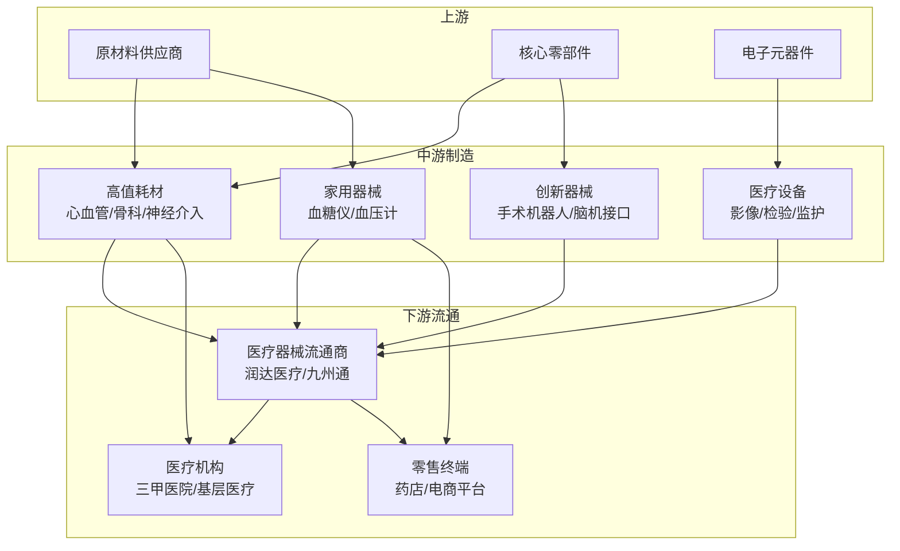

# 医疗器械行业全面分析报告（2026年3月）

> 更新日期：2026年3月12日  
> 关注焦点：九安医疗持续上涨背后的行业逻辑

---

## 📋 目录

1. [行业概述](#一行业概述)
2. [政策环境分析](#二政策环境分析)
3. [行业驱动因素](#三行业驱动因素)
4. [投资主线与机会](#四投资主线与机会)
5. [九安医疗个股分析](#五九安医疗个股分析)
6. [行业龙头梳理](#六行业龙头梳理)
7. [风险提示](#七风险提示)
8. [总结与展望](#八总结与展望)

---

## 一、行业概述

### 1.1 行业战略地位提升

**历史性突破**：2026年政府工作报告首次将"医疗器械高质量发展"作为独立议题列入，标志着行业从"数量增长"向"质量提升"的战略转变。

### 1.2 产业链结构

### 1.3 市场规模与增速

| 指标 | 2024年 | 2025年预期 | 2026年预期 | 复合增速 |
|------|--------|-----------|-----------|---------|
| 市场规模 | 1.2万亿元 | 1.35万亿元 | 1.52万亿元 | 12-15% |
| 国产化率 | 62% | 67% | 72%+ | +5pct/年 |
| 高端器械国产化率 | 35% | 42% | 50%+ | +7-8pct/年 |

---

## 二、政策环境分析

### 2.1 2026年七大政策调整

#### 1️⃣ 设备更新支持扩大
- **内容**：检验检测设备纳入国家设备更新项目
- **资金**：国家发改委和财政部安排超长期特别国债支持
- **影响**：利好医学影像、检验检测设备厂商

#### 2️⃣ 医保结算改革推进
- **目标**：2026年底即时结算占比达80%+
- **意义**：缓解企业回款压力，改善现金流
- **受益**：中小型医疗器械企业

#### 3️⃣ 高值耗材集采深化
- **进展**：第六批国采1月开标（药物涂层球囊、泌尿介入）
- **规则优化**：引入"锚点价"机制防止极端低价
- **方向**：反内卷，保护头部企业利润空间
- **2026年计划**：继续开展新批次集采

#### 4️⃣ 医保影像云建设
- **目标**：2027年底前建成全国"一张网"
- **2026年重点**：加速建设，设备需求提升

#### 5️⃣ 医疗服务价格统一
- **进展**：2026年将完成40批立项指南编制
- **覆盖**：脑机接口、人工心脏等创新产品
- **意义**：明确创新器械定价标准

#### 6️⃣ 国产产品标准明确
- **时间**：2026年1月1日起执行
- **标准**：取得国内医疗器械注册证的产品认定为国产
- **影响**：政府采购向国产倾斜，国产替代加速

#### 7️⃣ 反腐监督强化
- **重点**：查处新型、隐性腐败
- **影响**：行业规范化，优质企业受益

### 2.2 政策核心逻辑转变

**从"有没有"到"好不好"**：
- ❌ 过去：低价竞争、同质化严重
- ✅ 现在：质量导向、创新驱动
- 🎯 未来：高端突破、国际竞争

---

## 三、行业驱动因素

### 3.1 国产替代加速（核心逻辑）

#### 国产化率现状（2025年底数据）
| 品类 | 国产化率 | 进展 |
|------|---------|------|
| 整体二级品类 | 87.2%超过50% | 进展良好 |
| 高国产化率品类 | 76.3%超过70% | 领先优势 |
| 待突破品类 | 37个品类为零 | 多为高风险领域 |

#### 细分领域突破
- **冠脉支架**：国产主导，进入千元时代
- **药物涂层球囊**：国产企业瓜分约70%市场
- **神经介入**：国产市占率从10%→26%（2024年）
- **骨科手术机器人**：天智航国内唯一CFDA认证
- **光子计数CT**：2025年实现国产突破

#### 未来预期
**3-5年内国产医疗器械市场份额有望突破50%**

### 3.2 集采规则优化（拐点逻辑）

#### 集采规则演进
| 阶段 | 特征 | 影响 |
|------|------|------|
| 1.0阶段 （2019-2022） | 唯低价论 | 行业利润大幅压缩 |
| 2.0阶段 （2023-2025） | 引入质量评价 | 价格战趋缓 |
| 3.0阶段 （2026+） | 反内卷+创新倾斜 | 头部企业受益 |

#### 2026年第六批国采亮点
- **触发锚点价**：20个竞争组中8个组触发
- **价格保护**：防止极端低价，保护利润空间
- **国产受益**：头部国产企业中选价格较高
- **市场集中**：国产龙头市占率提升

#### 业绩拐点细分赛道
1. **电生理**：集采落地，价格稳定
2. **外周介入**：国产替代加速
3. **泌尿介入**：第六批集采刚完成
4. **心血管介入**：集采影响出清

### 3.3 创新突破（成长逻辑）

#### 2025年创新器械获批情况
- **获批数量**：76个国产创新医疗器械上市
- **趋势**：连续3年维持高位
- **突破领域**：
  - 光子计数CT
  - 脊柱外科手术导航
  - 经导管主动脉瓣膜
  - 持续血糖监测仪（CGM）

#### 科技热点方向
| 方向 | 技术成熟度 | 政策支持 | 商业化进展 |
|------|-----------|---------|-----------|
| **AI医疗** | 较成熟 | 强 | 影像诊断已落地 |
| **手术机器人** | 商业化初期 | 强 | 骨科领先，腔镜跟进 |
| **脑机接口** | 研发期 | 极强 | 临床试验加速 |
| **外骨骼机器人** | 商业化初期 | 中等 | 康复领域落地 |
| **CGM血糖监测** | 成熟 | 中等 | 2026年Q2上市潮 |

### 3.4 出海加速（增量逻辑）

#### 出海驱动因素
1. **国内集采压力**：倒逼企业寻求海外增量
2. **产品竞争力提升**：性价比优势明显
3. **国际认证突破**：FDA、CE认证加速
4. **渠道建设完善**：海外分销网络成型

#### 海外市场表现
- **增速对比**：海外业务增速 > 国内业务增速
- **占比提升**：部分龙头企业海外收入占比有望超50%
- **区域分布**：
  - 美国市场：高端创新产品
  - 欧洲市场：医疗设备
  - 新兴市场：性价比产品

#### 出海领先企业
- **消化内镜耗材**：海外成熟市场拓展领先
- **家用医疗器械**：品牌力强，可穿戴设备出海加速
- **手术机器人**：规模化出海，订单增长陡峭
- **IVD产品**：九安医疗四联检美国上市

---

## 四、投资主线与机会

### 4.1 三大核心主线

#### 主线一：出海与国际化 🌍

**投资逻辑**：
- 国内集采价格压力→海外寻找增量
- 产品力提升→国际竞争力增强
- 渠道完善→海外收入占比快速提升

**标的类型**：
- ✅ 海外业务占比30%+
- ✅ 国际认证齐全（FDA/CE）
- ✅ 海外渠道成熟
- ✅ 产品具有性价比优势

**关注细分赛道**：
1. 消化内镜耗材
2. 家用医疗器械（血糖仪、血压计、可穿戴）
3. 手术机器人
4. IVD体外诊断

#### 主线二：集采拐点与国产替代 📈

**投资逻辑**：
- 集采规则优化→价格战缓和
- 国产质量提升→替代加速
- 市场集中度提升→龙头受益

**标的类型**：
- ✅ 集采影响已出清
- ✅ 市占率领先
- ✅ 产品质量过硬
- ✅ 成本控制能力强

**关注细分赛道**：
1. 电生理（集采后价格稳定）
2. 外周介入（国产替代快速）
3. 泌尿介入（集采刚完成）
4. 神经介入（国产市占率快速提升）
5. 骨科耗材（集采影响见底）

#### 主线三：科技创新 🚀

**投资逻辑**：
- 政策大力支持创新
- 技术突破商业化加速
- 估值溢价空间大

**标的类型**：
- ✅ 技术壁垒高
- ✅ 临床数据积累深厚
- ✅ 产品管线丰富
- ✅ 研发投入高

**关注细分赛道**：
1. **AI医疗**：影像诊断、辅助决策
2. **手术机器人**：骨科、腔镜、血管介入
3. **脑机接口**：政策催化强
4. **CGM血糖监测**：2026年上市潮
5. **外骨骼机器人**：康复医疗

### 4.2 投资策略建议

#### 风格选择

**稳健型**：
- 低估值龙头
- 业绩确定性强
- 分红稳定
- 示例：医疗器械流通龙头、设备龙头

**成长型**：
- 高增长细分赛道
- 海外拓展加速
- 国产替代空间大
- 示例：神经介入、外周介入、家用器械

**科技型**：
- 创新技术突破
- 政策催化多
- 高风险高收益
- 示例：手术机器人、脑机接口、AI医疗

#### 配置建议

| 投资风格 | 配置比例 | 持仓周期 | 适合人群 |
|---------|---------|---------|---------|
| 稳健型 | 40-50% | 1-2年 | 风险厌恶型 |
| 成长型 | 30-40% | 6-12月 | 平衡型 |
| 科技型 | 10-20% | 3-6月 | 激进型 |

---

## 五、九安医疗个股分析

### 5.1 公司基本信息

| 项目 | 内容 |
|------|------|
| 证券代码 | 002432 |
| 公司全称 | 天津九安医疗电子股份有限公司 |
| 主营业务 | 家用医疗器械、IVD体外诊断 |
| 核心产品 | 电子血压计、血糖仪、体温计、四联检试剂盒、CGM |
| 市场地位 | 家用医疗器械行业领先企业 |

### 5.2 2026年3月涨势分析

#### 股价表现
- **3月2日**：涨停
- **3月4日**：连续4天累计涨幅16.52%
- **3月11日**：再次涨停
- **机构动向**：3月11日1家机构专用席位净买入1.04亿元

#### 持续上涨的六大催化剂

##### 1️⃣ 科技创新债发行（资金面）
- **规模**：50亿元
- **利率**：仅1.73%（体现市场认可）
- **用途**：研发投入、产能扩张、海外拓展
- **意义**：强化公司资金实力，支持长期发展

##### 2️⃣ IVD产品获批及销售进展（业绩面）
- **产品**：iHealth四联检试剂盒
- **认证**：获美国FDA 510(k)授权
- **销售渠道**：美国CVS药店、亚马逊平台上市销售
- **市场空间**：美国家用检测市场规模超百亿美元
- **意义**：海外收入增量确定性强

##### 3️⃣ CGM产品上市在即（预期面）
- **产品**：持续血糖监测仪（CGM）
- **进展**：预计2026年Q2在国内获批上市
- **市场空间**：国内CGM市场规模超200亿元
- **竞争格局**：国产替代加速，国产品牌份额提升
- **意义**：打开新的成长空间

##### 4️⃣ 业绩增长（基本面）
- **2025年业绩**：净利润同比增长21%-41%
- **增长驱动**：
  - 主业盈利能力持续增强
  - 资管业务贡献稳定收益
  - 医疗产品需求稳定
- **预期**：2026年业绩有望继续保持高增长

##### 5️⃣ 股份回购（信心面）
- **规模**：累计回购超4.5亿元
- **占比**：占总股本2.42%
- **意义**：彰显管理层对公司价值的信心
- **影响**：提振市场情绪，减少流通股本

##### 6️⃣ 产业拓展（战略面）
- **方向**：新增保健食品等经营范围
- **战略**：拓展大健康领域
- **协同**：与医疗主业形成协同效应
- **意义**：打开新的增长空间

### 5.3 核心竞争力分析

#### 产品矩阵完善
| 产品线 | 代表产品 | 市场地位 | 发展阶段 |
|--------|---------|---------|---------|
| 家用血压计 | 电子血压计 | 国内领先 | 成熟期 |
| 血糖监测 | 血糖仪 | 市场份额稳定 | 成熟期 |
| CGM | 持续血糖监测仪 | 即将上市 | 导入期 |
| IVD | 四联检试剂盒 | 美国市场拓展 | 成长期 |
| 体温监测 | 电子体温计 | 疫情后需求稳定 | 成熟期 |

#### 渠道优势
- **国内**：药店、电商、医疗机构全覆盖
- **海外**：
  - 美国：CVS、亚马逊等主流渠道
  - 欧洲：CE认证齐全
  - 新兴市场：持续拓展

#### 技术积累
- **血糖监测**：算法积累深厚
- **CGM**：传感器技术突破
- **IVD**：免疫层析技术领先

### 5.4 投资亮点

✅ **家用医疗器械龙头**：品牌力强，渠道完善  
✅ **海外拓展加速**：四联检美国上市，收入增量确定  
✅ **CGM产品上市在即**：打开新成长空间  
✅ **业绩高增长**：2025年净利润增长21%-41%  
✅ **估值合理**：科技创新债利率仅1.73%反映市场认可  
✅ **管理层信心足**：4.5亿元回购彰显信心

### 5.5 风险提示

⚠️ **CGM产品竞争风险**：国内CGM市场竞争激烈，需关注上市后市场表现  
⚠️ **海外市场不确定性**：汇率波动、贸易政策变化影响  
⚠️ **研发投入压力**：创新产品研发周期长、投入大  
⚠️ **疫情后需求波动**：部分产品需求受疫情影响较大

### 5.6 业绩预期

| 指标 | 2025年实际 | 2026年预期（乐观） | 2026年预期（中性） |
|------|-----------|-------------------|-------------------|
| 营业收入 | +20%+ | +30%+ | +20-25% |
| 归母净利润 | +21%-41% | +40%+ | +25-30% |
| CGM贡献 | - | 5-8亿元 | 3-5亿元 |
| 海外收入占比 | 30%+ | 40%+ | 35%+ |

---

## 六、行业龙头梳理

### 6.1 高值耗材领域

#### 心血管介入
| 公司 | 代码 | 细分赛道 | 亮点 |
|------|------|---------|------|
| 乐普医疗 | 300003 | 冠脉支架、球囊 | 产品线完整，国内龙头 |
| 微创医疗 | 00853.HK | 冠脉支架、心脏瓣膜 | 国际化领先，海外收入占比高 |
| 心脉医疗 | 688016 | 主动脉支架 | 细分领域龙头 |

#### 神经介入
| 公司 | 代码 | 细分赛道 | 亮点 |
|------|------|---------|------|
| 归创通桥 | 688501 | 颅内支架、栓塞产品 | 国产替代加速，业绩高增长 |
| 沛嘉医疗 | 09996.HK | 神经介入产品 | 产品管线丰富 |

#### 骨科耗材
| 公司 | 代码 | 细分赛道 | 亮点 |
|------|------|---------|------|
| 威高骨科 | 688161 | 创伤、脊柱 | 国内骨科龙头 |
| 大博医疗 | 002901 | 骨科植入物 | 产品线齐全 |
| 凯利泰 | 300326 | 脊柱、运动医学 | 集采后业绩修复 |

### 6.2 医疗设备领域

#### 影像设备
| 公司 | 代码 | 细分赛道 | 亮点 |
|------|------|---------|------|
| 联影医疗 | 688271 | CT、MRI、PET-CT | 国产高端影像龙头 |
| 迈瑞医疗 | 300760 | 监护仪、超声、检验 | 综合性医疗器械龙头 |
| 东软医疗 | - | CT、MRI | 国产影像先驱 |

#### 检验设备
| 公司 | 代码 | 细分赛道 | 亮点 |
|------|------|---------|------|
| 迈瑞医疗 | 300760 | 血液分析、生化免疫 | 综合实力强 |
| 安图生物 | 603658 | 化学发光 | 试剂+仪器一体化 |
| 新产业 | 300832 | 化学发光 | 基层市场优势 |

### 6.3 家用医疗器械

| 公司 | 代码 | 核心产品 | 亮点 |
|------|------|---------|------|
| **九安医疗** | 002432 | 血压计、血糖仪、CGM | CGM上市在即，海外拓展加速 |
| 鱼跃医疗 | 002223 | 血压计、制氧机、轮椅 | 家用医疗器械龙头 |
| 三诺生物 | 300298 | 血糖仪 | 血糖监测领域龙头 |

### 6.4 创新器械领域

#### 手术机器人
| 公司 | 代码 | 细分赛道 | 亮点 |
|------|------|---------|------|
| **天智航** | 688027 | 骨科手术机器人 | 国内唯一CFDA认证 |
| 微创机器人 | 02252.HK | 腔镜手术机器人 | 产品线丰富 |
| 术锐科技 | - | 腔镜手术机器人 | 技术领先 |

#### IVD体外诊断
| 公司 | 代码 | 细分赛道 | 亮点 |
|------|------|---------|------|
| 安图生物 | 603658 | 化学发光 | 国产替代加速 |
| 华大基因 | 300676 | 基因测序 | 技术壁垒高 |
| 金域医学 | 603882 | 第三方检验 | ICL龙头 |

### 6.5 医疗器械流通

| 公司 | 代码 | 亮点 |
|------|------|------|
| **润达医疗** | 603108 | AI智慧供应链，流通龙头 |
| 九州通 | 600998 | 医药流通龙头，全国网络 |
| 国药控股 | 01099.HK | 国企背景，渠道优势 |

---

## 七、风险提示

### 7.1 政策风险

#### 集采扩围风险
- **风险**：集采范围继续扩大，价格下降超预期
- **影响品种**：高值耗材、大型设备
- **应对**：关注集采规则优化，选择头部企业

#### 医保支付政策变化
- **风险**：医保控费趋严，支付范围调整
- **影响**：创新器械商业化进度
- **应对**：关注医保准入目录更新

### 7.2 市场风险

#### 国产替代不及预期
- **风险**：医生使用习惯改变慢，国产器械接受度低
- **影响领域**：高端影像、复杂介入器械
- **应对**：关注临床数据积累，选择技术过硬企业

#### 创新产品商业化风险
- **风险**：技术突破到商业化周期长，市场接受度不确定
- **影响领域**：手术机器人、脑机接口、AI医疗
- **应对**：分散投资,关注临床进展

### 7.3 竞争风险

#### 跨国企业加大中国布局
- **风险**：美敦力、强生等巨头降价竞争
- **影响**：国产企业市场份额
- **应对**：关注差异化竞争优势

#### 同质化竞争加剧
- **风险**：部分领域产能过剩，价格战
- **影响领域**：低端耗材、常规设备
- **应对**：规避低端产品，关注创新能力

### 7.4 财务风险

#### 应收账款风险
- **风险**：医院账期长，坏账风险
- **影响**：现金流压力，资金成本上升
- **应对**：关注应收账款周转率，医保结算改革缓解

#### 研发投入压力
- **风险**：创新器械研发投入大，失败风险高
- **影响**：短期盈利能力
- **应对**：关注研发管线丰富度，分散风险

---

## 八、总结与展望

### 8.1 行业核心判断

#### 1. 政策明确支持，行业战略地位提升
2026年政府工作报告首次将"医疗器械高质量发展"列入，政策从"有没有"转向"好不好"，反映国家对行业的重视程度提升到新高度。

#### 2. 国产替代是核心逻辑
- 3-5年内国产市场份额有望突破50%
- 神经介入、外周介入等细分领域国产替代加速
- 高端器械国产化率有望从35%提升至50%+

#### 3. 集采规则优化带来业绩拐点
- 引入"锚点价"机制防止极端低价
- 反内卷、创新倾斜政策明确
- 头部企业利润空间得到保护

#### 4. 创新与出海是投资主线
- **创新**：AI医疗、手术机器人、CGM等商业化加速
- **出海**：海外收入占比快速提升，增速超国内

### 8.2 九安医疗持续上涨背后的逻辑

九安医疗的持续上涨并非单一事件驱动，而是多重因素共振：

1. **行业层面**：家用医疗器械不受集采影响，成长性确定
2. **公司层面**：CGM上市在即+四联检美国销售+50亿科创债
3. **资金层面**：机构资金持续买入，管理层4.5亿回购
4. **预期层面**：业绩高增长（21%-41%）+海外拓展加速

**核心逻辑**：九安医疗是医疗器械行业"创新+出海"双主线的典型标的。

### 8.3 2026年投资策略

#### 主线一：出海加速（确定性最高）
- **逻辑**：海外收入增速超国内，增量确定
- **标的**：消化内镜、家用器械、手术机器人
- **代表**：九安医疗（四联检美国销售）

#### 主线二：国产替代+集采拐点（业绩修复）
- **逻辑**：集采规则优化+国产份额提升
- **标的**：神经介入、外周介入、骨科耗材
- **代表**：归创通桥（神经介入龙头）

#### 主线三：科技创新（高弹性）
- **逻辑**：技术突破+政策催化+商业化加速
- **标的**：手术机器人、CGM、AI医疗
- **代表**：天智航（骨科机器人）、九安医疗（CGM）

### 8.4 风险与机遇并存

#### 风险
- 集采扩围超预期
- 创新产品商业化不及预期
- 国际贸易摩擦影响出海

#### 机遇
- 政策持续支持创新
- 国产替代空间巨大
- 海外市场增量确定
- 老龄化带来需求增长

### 8.5 最后的话

**医疗器械行业正处于从"跟跑"向"并跑"、局部"领跑"的转型期**。

**投资医疗器械，就是投资：**
- 中国制造升级
- 国产替代浪潮
- 人口老龄化红利
- 科技创新突破

**2026年，医疗器械行业值得重点关注！**

---

## 📝 信息来源

### 官方信息
- 国家药监局
- 国家医保局
- 各上市公司年报及公告

### 研究机构
- 国金证券：《2026年医疗器械板块投资策略》
- 中信建投：《集采规则优化，看好器械板块中长期投资机会》
- 东方财富行业研究数据

### 新闻媒体
- 新浪财经
- 东方财富网
- 证券之星
- 健康界

---

> ⚠️ **免责声明**：本报告仅供学习研究使用，不构成投资建议。投资有风险,入市需谨慎。文中观点不代表任何投资建议，请投资者根据自身情况独立判断。
