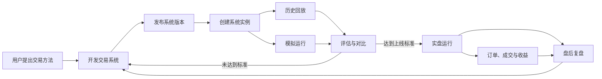
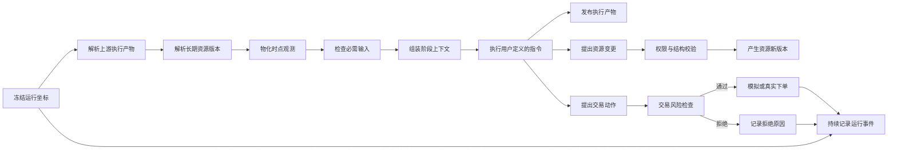

# 交易系统平台总体设计

> 状态：讨论稿。
>
> 本文描述平台怎样帮助用户开发、验证、优化和运行自己的交易系统。
> 本文只定义平台通用机制，不定义任何具体交易方法的业务概念。

---

## 1. 一句话说明

**用户负责定义“怎么交易”，平台负责保证这个定义能够被版本化、可靠运行、验证、比较、安全执行和完整追溯。**

平台不理解用户交易方法中的业务术语，也不替用户判断一种方法是否有效。平台提供的是一套交易系统运行基础设施：

- 交易系统编辑与版本管理。
- 行情、账户、持仓等数据能力。
- 阶段运行和上下文组装。
- 历史回放与模拟交易。
- 风险检查与真实交易接入。
- 运行证据、指标和版本对比。
- 长期状态的版本化管理。

平台不能保证盈利。它能保证交易方法被稳定执行、不同版本被公平验证、风险规则不能被模型绕过，以及每个决定都能够追溯。

---

## 2. 用户使用平台的完整链路



这条链路包含六个阶段：

1. 用户把交易思想写成可执行的交易系统。
2. 平台发布一个不可修改的系统版本。
3. 用户为账户和使用场景创建系统实例。
4. 用户使用历史回放和模拟交易验证系统。
5. 用户比较不同版本并持续优化。
6. 通过上线标准的版本进入实盘，实盘结果继续进入下一轮复盘与优化。

---

## 3. 第一阶段：开发交易系统

### 3.1 交易系统定义什么

交易系统定义（Trading System Definition）描述一套交易方法如何运行。用户主要定义四类内容。

#### 阶段（Stage）

用户把交易过程拆成若干阶段，例如开盘筛选、盘中观察、收盘复核。名称和数量完全由用户决定，平台不预设固定阶段。

每个阶段拥有稳定的内部编号和可修改的显示名称。其他阶段引用内部编号，不引用显示名称。

#### 指令（Instruction）

指令描述阶段怎样分析、判断以及满足什么输出质量要求，通常由提示词（Prompt）承载。

指令负责交易语义，不负责：

- 查询数据库表。
- 拼接存储键。
- 寻找上一阶段的内容。
- 决定正文保存到哪里。
- 自行恢复运行状态。

#### 输入契约（Input Contract）

输入契约声明阶段开始之前必须或可以获得什么。输入由平台解析并注入，模型不需要自行猜测。

例如，一个阶段可以声明需要：

- 某个上游阶段的执行结果。
- 某个长期资源的指定版本。
- 当前时点的行情或持仓。
- 系统实例中的某项设置。

必需输入缺失时，平台阻止阶段执行；可选输入缺失时，平台明确标记不可用。

#### 输出契约（Output Contract）

输出契约声明阶段可以或必须产生什么结果，例如分析报告、交易判断、资源变更请求或交易动作。

阶段通过输出编号发布结果，不接触底层表名、文档类型或命名规则。

### 3.2 输入和能力必须分开

输入（Input）和能力（Capability）不是一回事。

```text
输入：平台保证在阶段开始前已经提供。
能力：模型运行过程中可以按需使用，也可能不使用。
```

每轮都不能遗漏的行情、持仓或上游结果应当是输入。临时查询分钟线、搜索公告或查询个股详情更适合作为能力。

### 3.3 发布系统版本

开发中的系统可以反复修改。用户确认后发布系统版本（System Version）。

已发布版本不可修改。后续优化必须产生新版本。一次运行始终绑定一个明确的系统版本，因此历史结果不会因后来编辑而改变。

交易系统本身拥有稳定编号，系统版本是这个交易系统的一次不可变快照。二者不能合并：用户是在持续开发同一个交易系统，而不是每次修改都创建一个毫无关系的新系统。

系统版本至少冻结：

- 阶段定义。
- 指令版本。
- 输入和输出契约。
- 可用能力与权限。
- 调度和重试策略。
- 系统设置结构。
- 系统声明的长期资源结构。

---

## 4. 第二阶段：创建系统实例

系统版本描述“方法”，系统实例（System Instance）描述“某个用户怎样实际使用这个方法”。

同一系统版本可以创建多个系统实例。例如：

- 一个实例绑定模拟组合并允许自动模拟下单。
- 一个实例绑定真实账户并要求人工确认。
- 两个实例使用不同的风险参数或不同的标的范围。

系统实例保存：

- 默认采用的系统版本。
- 设置值和设置版本。
- 长期资源及其绑定关系。
- 一个或多个交易组合。
- 运行和交易权限。
- 风险策略和确认策略。

普通模拟和实盘运行默认使用系统实例当前采用的系统版本。实验运行可以显式选择其他系统版本，但这个选择只属于该次实验，不会悄悄改变系统实例的默认版本。一次运行最终冻结实际使用的版本编号。

### 4.1 系统实例与交易组合的边界

系统实例管理“这套方法怎样被使用”；交易组合（Portfolio）只管理“钱和仓位”。

| 系统实例（System Instance） | 交易组合（Portfolio） |
|---|---|
| 系统版本 | 现金 |
| 设置 | 持仓 |
| 长期资源 | 成交 |
| 资源绑定 | 净值 |
| 权限和风险策略 | 核算结果 |

长期资源默认属于系统实例，不属于交易组合。这样模拟、实验和实盘可以引用同一长期资源的不同版本，而不需要复制全部内容。

### 4.2 设置与长期资源的边界

设置（Setting）表示系统实例怎样运行，例如数值阈值、开关、市场范围或风险参数。长期资源表示系统在业务上长期管理、具有独立身份并可能与其他对象建立关系的状态。

```text
只是配置这套系统怎样运行 → 设置（Setting）
需要稳定编号、独立版本和业务关系 → 长期资源（Resource）
```

设置结构由系统版本声明，设置值属于系统实例并保留版本。一次运行冻结实际使用的设置版本。不能因为设置也需要保存，就把所有配置都塞进长期资源。

---

## 5. 平台中的核心数据概念

### 5.1 长期资源（Resource）

长期资源表示跨多次运行持续存在、具有稳定身份并会随时间演化的系统状态。

平台只规定长期资源必须具备：

- 稳定编号。
- 所属系统实例。
- 资源类型编号。
- 当前版本。
- 完整版本历史。
- 由系统定义声明的内容结构。

平台不知道某种长期资源在具体交易方法中代表什么，也不硬编码它的业务字段和状态流转。

修改长期资源不会覆盖历史，而是产生新的资源版本（Resource Revision）。历史运行继续引用当时使用的旧版本。

### 5.2 执行产物（Artifact）

执行产物表示某次阶段执行产生的业务结果，例如分析正文、结构化判断或候选结果。

执行产物具有以下约束：

- 属于一次明确的阶段执行。
- 通过输出编号表达业务身份。
- 产生后不可修改。
- 可以被后续阶段作为输入。
- 可以链接正文、结构化数据或附件。

同一个阶段重新运行会产生新的执行产物，不会覆盖旧产物。

### 5.3 时点观测（Observation）

时点观测表示某个运行时钟点能够看到的客观状态，例如行情、指数、持仓或账户状态。

时点观测必须记录：

- 观测时间（As Of）。
- 数据提供者（Provider）。
- 查询参数。
- 使用的长期资源版本。
- 数据版本、内容快照或可验证哈希。

执行产物是“阶段作出的结果”，时点观测是“阶段当时看到的事实”。两者都不可修改，但来源和审计意义不同。

### 5.4 运行事件（Run Event）

运行事件记录执行过程中发生的事情，例如：

- 阶段和轮次开始。
- 模型请求和响应。
- 工具调用和返回。
- 重试、错误和超时。
- 风险拒绝。
- 阶段和轮次结束。

运行事件只追加、不覆盖，并按运行、阶段执行和顺序号排列。

原始对话过程是一组运行事件。供用户阅读的完整对话记录是这些事件的展示结果，不再作为长期资源或执行产物存储。

### 5.5 内容载体（Content）

文档（Document）不再是领域对象，只表示内容的展示形式，例如 Markdown 正文。

内容块（Content Blob）是底层存储概念，可以保存正文、结构化数据或附件。它没有独立的业务身份，只被长期资源版本、执行产物或时点观测引用。

初期可以继续把正文直接存入业务表。只有出现大附件、内容去重或对象存储需求时，才需要物理拆出内容块表。

### 5.6 五类概念的快速判断

| 判断问题 | 类型 |
|---|---|
| 明天仍是同一个对象，只是状态发生变化吗？ | 长期资源（Resource） |
| 是某次阶段运行得出的结果吗？ | 执行产物（Artifact） |
| 是某个时间点从行情、账户或其他数据源读取到的事实吗？ | 时点观测（Observation） |
| 只是记录运行过程中发生了一件事吗？ | 运行事件（Run Event） |
| 只是正文、数据或附件本身吗？ | 内容载体（Content） |

---

## 6. 标的集合的定位

标的集合（Instrument Collection）是平台可以提供特殊支持的一种长期资源，因为行情能力需要知道怎样从一组标的批量生成时点观测。

平台只理解它的通用结构：

```text
标的集合（Instrument Collection）
├── 稳定编号
├── 显示名称
├── 技术状态
├── 当前版本
└── 集合版本
    └── 成员
        ├── 标的编号
        └── 由系统声明的成员字段
```

平台不知道一个集合是观察范围、候选范围、排除范围还是其他用途。这些含义由具体系统的资源定义、输入绑定或产品界面决定。

“自选”或“自选组”只可以是某个具体产品视图或交易系统使用的显示名称，不能成为平台核心协议。

### 6.1 临时结果与长期集合的边界

阶段临时筛出一批标的时，首先产生执行产物，而不是直接修改长期标的集合。

只有输出契约明确允许，并经过系统权限策略后，阶段才能：

1. 创建一个新的标的集合。
2. 为现有标的集合产生新版本。
3. 将执行产物中的部分结果提升为长期集合成员。

这条边界防止任何临时筛选结果自动污染长期状态。

### 6.2 绑定与业务关系不能混用

资源绑定（Resource Binding）表示系统实例怎样满足某个阶段输入，例如将集合编号 12 绑定到阶段输入“主要观察范围”。

业务关系（Resource Relation）表示两个长期资源在交易方法中的语义联系。

二者目的不同，不能合并成一张含义模糊的关联表：

```text
资源绑定：系统实例输入槽位 → 长期资源
业务关系：长期资源 → 长期资源
```

---

## 7. 第三阶段：运行交易系统

### 7.1 创建一次运行

用户发起运行时，需要选择：

- 系统实例。
- 系统版本。
- 交易组合。
- 运行方式：历史回放、模拟或实盘。
- 交易日期和起始时钟。
- 用户本次运行请求。

平台创建一次运行（Run），并冻结运行封面：

- 用户、系统实例和系统版本。
- 交易组合。
- 运行方式、日期和时钟。
- 设置版本。
- 初始长期资源绑定和版本。
- 指令版本。
- 风险和交易权限。

### 7.2 运行与阶段执行的边界

一次运行可以包含多个阶段，一个循环阶段又可以执行多轮。

因此必须有独立的阶段执行（Stage Execution）：

```text
一次运行（Run）
├── 阶段执行一
├── 阶段执行二
├── 阶段执行三，第 1 轮
├── 阶段执行三，第 2 轮
└── 阶段执行三，第 3 轮
```

输入、时点观测、执行产物和运行事件都应绑定具体阶段执行，而不是只绑定整场运行。否则同一个对象在不同轮次被读取时，证据会被合并，无法精确复现。

### 7.3 一次阶段执行的内部链路



具体步骤如下。

1. 平台固定用户、系统版本、组合、时钟、阶段和轮次。
2. 平台按照输入契约读取上游执行产物。
3. 平台按照资源绑定读取明确的长期资源版本。
4. 平台根据运行时钟查询行情、持仓和账户，形成时点观测。
5. 平台检查所有必需输入是否可用。
6. 平台使用稳定输入编号组装上下文。
7. 模型按照用户定义的指令分析，并按权限调用能力。
8. 平台验证并发布声明的执行产物。
9. 如果阶段声明了长期资源变更，平台验证后产生资源新版本。
10. 如果阶段提出交易动作，平台先执行独立的风险检查。
11. 全过程持续写入运行事件和证据关系。

### 7.4 交易动作的边界

模型只能提出交易动作，不能直接修改现金、持仓和成交记录。

真实或模拟交易必须经过平台硬规则，例如：

- 当前实例是否允许交易。
- 当前模式是否允许真实下单。
- 是否需要人工确认。
- 资金是否充足。
- 仓位是否超过限制。
- 最小交易单位是否满足。
- 市场交易规则是否满足。

通过后，订单和成交进入交易领域；被拒绝时，拒绝原因进入运行事件。模型给出的交易建议仍然作为执行证据保留。

---

## 8. 第四阶段：历史回放与模拟验证

### 8.1 历史回放（Replay）

历史回放让系统按照过去某一天的时钟重新运行，主要验证：

- 系统当时能够看到什么。
- 是否读取了未来数据。
- 输入缺失时是否正确失败。
- 当时会作出什么决定。
- 决定使用了哪些资源版本和时点观测。

历史回放必须遵守运行时钟。任何数据提供者都不能返回当前时钟之后的数据。

长期资源同样受时间边界约束。用于因果验证的历史回放，默认只能读取在模拟开始时间已经存在的资源版本。如果用户明确注入后来形成的资源版本，平台必须把本次运行标记为“注入后验状态”，它可以用于情景分析，但不能当作无未来信息的验证结果。

### 8.2 模拟交易（Paper Trading）

模拟交易使用实时行情和虚拟资金，主要验证：

- 系统能否跨天稳定运行。
- 调度、重试和异常处理是否可靠。
- 交易频率和仓位变化是否合理。
- 风险规则是否有效。
- 在真实市场节奏下是否具有可执行性。

历史回放用于快速复现过去，模拟交易用于观察系统在真实节奏下的连续行为。

### 8.3 实验中的状态隔离

实验运行不能直接修改系统实例的正式长期资源。

实验启动时冻结正式资源版本。如果实验需要修改长期资源，平台为实验创建基于该版本的隔离分支，并采用写时复制（Copy On Write）：

- 未修改的资源继续引用原版本。
- 第一次修改时才产生实验分支版本。
- 实验结束后默认丢弃分支。
- 用户明确审核后，才可以把选定变更提升回正式实例。

交易组合仍然独立保存模拟现金、持仓和成交。资源版本引用与组合核算状态不再混在一起复制。

---

## 9. 第五阶段：评估和优化

一次运行结束后，平台从成交、净值和运行记录中计算指标，例如：

- 收益率和最大回撤。
- 胜率、盈亏比和换手率。
- 交易次数和持仓集中度。
- 风险规则触发次数。
- 模型调用成本。
- 失败、重试和超时次数。

指标只回答“结果怎样”，证据链回答“为什么得到这个结果”。用户应当能够追溯：

- 哪个系统版本产生了这次运行。
- 哪个阶段执行产生了某个决定。
- 当时使用了哪些输入和具体版本。
- 当时看到了什么时点观测。
- 模型调用了哪些能力。
- 交易动作为什么通过或被拒绝。
- 最终订单是否成交以及怎样影响组合。

### 9.1 公平比较不同版本

优化时不能覆盖旧系统版本。用户基于旧版本创建新版本，并使用相同实验条件对比：

- 相同历史区间。
- 相同初始资金和持仓。
- 相同资源起始版本。
- 相同数据时钟和数据提供者版本。
- 相同费用和交易规则。
- 相同模型、模型参数和调用策略。

平台记录差异来自系统定义、设置还是运行环境，避免把不同初始条件误认为系统优化效果。

对于存在随机性的模型，同一版本和同一场景应当允许重复运行。平台分别展示单次结果和多次运行的结果分布，避免把一次偶然结果当作稳定优势。

### 9.2 从运行结果沉淀长期状态

执行产物不会自动变成长期资源。

用户或获得授权的阶段可以执行明确的提升（Promotion）操作：

```text
执行产物
    ↓ 审核、选择、结构校验
创建长期资源或产生资源新版本
```

这条边界避免模型的一次临时结论未经确认就改变后续所有运行。

---

## 10. 第六阶段：实盘运行

用户为系统实例选择经过验证的系统版本，绑定真实账户或实盘组合，并设置权限和风险规则。

```text
实时行情与账户状态
        ↓
时点观测（Observation）
        ↓
用户发布的系统版本
        ↓
执行产物（Artifact）与交易动作
        ↓
平台风险检查与人工确认
        ↓
真实订单
        ↓
成交、持仓、资金和净值
```

实盘中的系统版本、设置版本和资源版本都必须可追溯。修改正式运行逻辑时，应当发布新系统版本，并经过重新验证后切换。

实盘结果继续进入运行评估和盘后复盘，形成下一轮开发、验证和发布循环。

---

## 11. 平台与交易系统的职责边界

| 平台负责 | 交易系统负责 |
|---|---|
| 系统、指令和资源的版本机制 | 交易思想和业务术语 |
| 阶段调度和上下文组装 | 阶段怎样分析和判断 |
| 输入解析和缺失检查 | 需要哪些输入 |
| 行情、账户和交易能力 | 何时使用可选能力 |
| 时钟约束和防未来数据 | 如何解释得到的数据 |
| 执行产物和证据存储 | 输出结果的业务含义 |
| 权限、风险检查和订单执行 | 提出什么交易动作 |
| 实验隔离和版本对比 | 怎样评估和优化方法 |

平台只理解通用机制，不通过核心代码、数据库枚举、通用接口或前端默认值定义具体交易方法概念。

---

## 12. 所有权和生命周期总表

| 对象 | 所有者 | 是否可修改 | 如何保留历史 |
|---|---|---|---|
| 系统定义（System Definition） | 用户或组织 | 草稿可修改 | 发布为不可变系统版本 |
| 系统实例（System Instance） | 用户或组织 | 可以配置 | 设置和绑定留版本 |
| 长期资源（Resource） | 系统实例 | 当前状态可演化 | 每次修改产生资源版本 |
| 标的集合（Instrument Collection） | 系统实例 | 当前成员可演化 | 每次修改产生集合版本 |
| 交易组合（Portfolio） | 系统实例 | 通过交易变化 | 成交和净值记录 |
| 运行（Run） | 系统实例 | 封面创建后冻结 | 整场执行记录 |
| 阶段执行（Stage Execution） | 运行 | 不可修改 | 精确输入输出证据 |
| 执行产物（Artifact） | 阶段执行 | 不可修改 | 每次执行产生新对象 |
| 时点观测（Observation） | 阶段执行 | 不可修改 | 快照、引用或哈希 |
| 运行事件（Run Event） | 阶段执行 | 只追加 | 有序事件流 |
| 订单与成交 | 交易组合 | 不覆盖 | 交易流水 |

---

## 13. 边界检查

### 13.1 已经足够清晰的边界

#### 平台机制与交易方法语义

平台定义版本、输入、输出、资源、运行和交易机制；具体交易系统定义业务概念。这条边界明确，能够避免某个交易方法的术语重新进入平台核心。

#### 系统定义与系统实例

系统定义拥有稳定身份，系统版本是不可变的方法快照；系统实例保存某个用户的默认版本、参数、资源、组合和权限。实验可以覆盖版本但不改变实例默认值，边界明确。

#### 系统实例与交易组合

系统实例拥有配置和长期资源；交易组合只拥有现金、持仓、成交和净值。这比让全部知识随组合复制更清晰。

#### 长期资源与执行产物

是否具有跨运行稳定身份，是两者的决定性区别。长期资源通过版本演化，执行产物产生后不可修改。临时结果通过明确提升才能进入长期状态。

#### 执行产物与时点观测

执行产物是阶段得出的结果；时点观测是阶段从外部世界读取的事实。虽然都不可修改，但来源、时间约束和审计要求不同。

#### 运行事件与业务结果

运行事件表达“发生过什么”，执行产物表达“阶段产出了什么”。对话、调用和错误属于事件流，不再伪装成文档。

#### 运行与阶段执行

运行是整场容器，阶段执行是一次具体调用或轮次。所有证据绑定阶段执行，可以避免多轮输入输出被合并。

#### 输入与能力

输入由平台确定性提供，能力由模型按需调用。关键基线数据不会依赖模型是否记得查询。

#### 设置与长期资源

设置配置系统实例怎样运行，长期资源表达系统长期管理的有身份状态。设置不能因为需要持久化就自动变成长期资源。

#### 历史时钟与长期状态

防未来数据不仅约束行情，也约束长期资源版本。因果回放使用当时已经存在的版本；显式注入后验状态只能作为带标记的情景分析。

#### 资源绑定与业务关系

资源绑定服务于运行装配，业务关系服务于领域表达。二者用途不同，不能用一个模糊关系替代。

### 13.2 仍需在实现设计中确定的契约

这些问题不会推翻总体边界，但必须在数据库和接口设计前定稿：

1. 资源结构（Resource Schema）使用什么描述和校验标准。
2. 系统实例升级系统版本时，已有设置和长期资源怎样检查兼容性及执行结构迁移。
3. 哪些阶段可以直接产生资源新版本，哪些必须由用户审核。
4. 时点观测保存完整快照、规范化引用还是内容哈希。
5. 标的集合成员的通用字段和系统自定义字段怎样分层校验。
6. 系统实例之间共享长期资源时采用复制、授权还是显式导入。
7. 实验分支的提升、冲突检查和合并规则。
8. 多输出阶段怎样验证必需输出以及怎样处理部分成功。
9. 真实交易中的人工确认、超时和撤单状态机。

### 13.3 对当前实现的判断

当前实现尚未达到本文边界，主要差距是：

- 文档仍同时承担长期状态、阶段产物、运行对话和证据快照。
- 文档类型仍参与阶段寻址、界面分类和生命周期判断。
- 阶段输入目前主要支持上游文档式产物，长期资源和时点观测尚未成为完整输入类型。
- 自选组仍以名称作为身份，缺少稳定编号、技术状态和明确版本引用。
- 市场扫描仍隐式读取全部自选组，没有通过阶段输入绑定决定范围。
- 长期内容仍随实验组合物理复制，系统实例与组合的所有权边界尚未落地。
- 运行证据主要绑定整场运行，同一对象跨阶段、跨轮次使用时可能失去精确次数和版本语义。

因此，本文的概念边界已经足以指导下一阶段的数据模型和迁移设计，但当前代码还只是部分实现，不能把已有表结构当作最终模型。

---

## 14. 设计结论

1. 平台只提供通用机制，具体交易方法定义全部业务语义。
2. 系统版本保存不可变的方法定义，系统实例保存用户实际配置。
3. 长期资源属于系统实例，交易组合只负责资金和仓位核算。
4. 长期资源有稳定身份并通过版本演化；执行产物属于单次阶段执行且不可修改。
5. 时点观测表达运行时事实，运行事件表达执行过程，二者都不再作为文档处理。
6. 文档只是一种内容展示形式，不是平台领域对象。
7. 标的集合是可选的通用资源结构，“自选组”等名称和用途不进入平台协议。
8. 阶段临时结果必须经过明确提升，才能修改长期状态。
9. 输入、能力、输出和交易动作分别建模，模型不能绕过平台调度和风险规则。
10. 所有输入、输出、观测、资源版本和交易结果都绑定具体阶段执行，形成可复现证据链。
11. 历史回放的时间边界同时约束行情和长期资源，后验状态不能伪装成因果验证。

最终的平台闭环是：

```text
开发交易系统
    ↓
发布不可变版本
    ↓
创建用户实例
    ↓
历史回放与模拟验证
    ↓
版本对比和优化
    ↓
实盘运行与风险控制
    ↓
成交、评估和复盘
    ↓
进入下一轮系统开发
```
