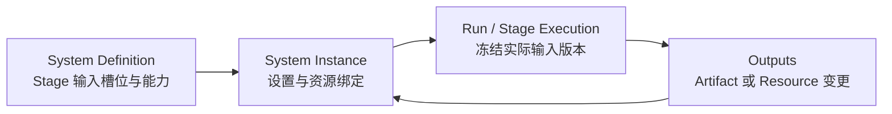
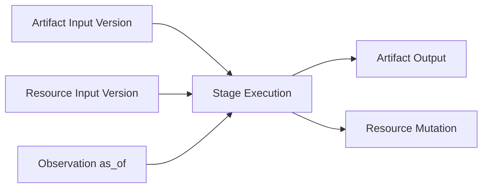

# 交易系统阶段上下文设计(讨论稿 v0.1)

> 日期:2026-08-21。
> 状态:**讨论中,未定稿,未实施**。
> 本文聚焦一个问题:一个交易系统的某个 Stage 启动时,平台怎样确定它应当获得
> 哪些指令、上下文、能力和输出约束。
> 本文不决定具体表结构、API 和迁移脚本;这些内容在概念模型确认后另行设计。

---

## 0. 一句话

**Prompt 决定 Stage 怎么思考;Input Contract 决定 Stage 启动时确定能看到什么;
Capability 决定它还可以主动做什么;Output Contract 决定它应当留下什么。**

`watchlist` 不属于 Prompt、行情或文档。它应被抽象为可选、版本化的
`InstrumentSet`(标的集合)资源;Stage 通过输入绑定引用它,行情 Provider 再把它
转换为某一时刻的 Observation(观测快照)。

---

## 1. 当前问题

现有实现把多种职责放进了 Prompt:

- Prompt 写死 `get_doc(doc_type='premarket', trade_date=...)`,隐式定义阶段依赖。
- Prompt 要求模型先 `list_docs` 再读取最近轮次,恢复运行状态。
- Prompt 要求每轮调用 `scan_market`,平台并不保证模型实际完成了基线扫描。
- `scan_market` 固定包含指数、持仓、全部自选组、板块和异动,不同系统不能组合。
- 预期文档通过 `meta.watchlist='名称'` 关联自选组,改名可能断开关系。
- 自选组是否有效通过 `archived-` 名称前缀表达,状态与显示名称混在一起。
- Prompt 直接调用 `save_doc(doc_type=...)` 和 `save_watchlist(name=...)`,因此还知道
  存储分类、命名约定等基础设施细节。

这会造成三个后果:

1. 新交易系统必须模仿默认预期系统的术语和文档名称。
2. 场次到底读取了什么取决于模型是否按 Prompt 操作,不够确定,也不易复现。
3. 平台通用能力与某个交易方法的领域约定耦合,例如所有调用 `scan_market` 的系统
   都会得到自选组快览。

目标不是把 `premarket` 或 `watchlist` 换成另一个可配置字符串,而是明确不同概念的
边界和连接方式。

---

## 2. 六类概念

| 概念 | 回答的问题 | 例子 | 生命周期 |
|---|---|---|---|
| **Instruction** | 应该怎样分析和决策? | system prompt、stage prompt | 定义级,版本化 |
| **Artifact** | 之前的执行产生了什么内容? | 开盘计划、研究报告、轮次结论 | 执行产生,不可变版本 |
| **Resource** | 系统长期管理什么有身份的对象? | 标的集合、黑名单、基准组合 | 跨执行存活,状态版本化 |
| **Observation** | 某个时钟点客观上是什么状态? | 行情快照、持仓快照、集合行情 | 时间敏感,执行时物化 |
| **Capability** | 模型还被允许主动做什么? | 查 K 线、联网搜索、下单 | 定义级授权 |
| **Setting** | 这个系统实例如何配置? | 仓位上限、关注市场、风险参数 | 实例级配置,版本化 |

几个重要边界:

- `doc_type` 是 Artifact 的存储分类,不是阶段编排协议。
- Tool 是 Capability,不是 Input。拥有查询能力不等于本轮已经查询并读到了数据。
- “用户定义”不是第七种类型,只是来源和所有权。用户可以定义 Prompt、Resource 或
  Setting;Stage 也可以产生 Artifact 或 Resource。
- Resource 保存业务身份和结构;Observation 保存该资源在某个时刻投影出的客观状态。

---

## 3. 三层模型:定义、实例、执行

当前容易混淆的另一个原因,是交易系统模板、用户实际配置和一次运行没有被完全分开。

### 3.1 System Definition

交易系统的模板,声明:

- 有哪些 Stage。
- 每个 Stage 使用哪个 Prompt。
- 每个 Stage 需要哪些类型的输入槽位。
- 每个 Stage 可调用哪些 Capability。
- 每个 Stage 应发布哪些输出。
- 循环、时间窗、请求预算等执行策略。

定义层只声明“需要一个 `focus_sets` 输入”,不直接写某个用户的“存储芯片池”。

### 3.2 System Instance / Portfolio Configuration

用户实际运行这个系统时的配置,负责:

- 将具体 Resource 绑定到定义层的输入槽位。
- 保存用户参数和系统参数。
- 保存系统运行过程中持续演化的知识与资源。
- 区分实盘组合、模拟组合和实验组合的状态。

例如,用户可以把“存储芯片池”和“机器人池”绑定到 `observe.focus_sets`。

### 3.3 Run / Stage Execution

一次实际执行,负责冻结证据:

- 使用的 Prompt 版本。
- 解析到的 Artifact 版本。
- 解析到的 Resource 及其版本。
- 实际物化的 Observation 及时间点。
- 实际调用过的 Tool。
- 发布的 Artifact、Resource 变更和交易行为。

因此可复现的对象不是“今天运行过 observe”,而是“observe 在这个时钟、组合和输入
版本下运行过”。



---

## 4. Stage Contract

建议一个 Stage 明确包含五部分:

```json
{
  "id": "observe",
  "title": "盘中决策",
  "prompt": "market_observer",
  "inputs": [],
  "capabilities": [],
  "outputs": [],
  "execution": {}
}
```

### 4.1 Instruction

`prompt` 只描述分析方法、决策规则和输出质量要求,不负责:

- 拼接存储键。
- 寻找上游文档。
- 判断应读取最近几轮。
- 记忆必须调用哪些基线扫描。
- 选择输出存到什么 `doc_type`。

### 4.2 Inputs

`inputs` 是 Stage 启动前由引擎解析的确定性上下文。Input 可以来自 Artifact、
Resource、Observation 或 Setting,但每个输入都应具有稳定的本地 ID。

### 4.3 Capabilities

`capabilities` 是模型可按需使用的操作白名单。建议按 Stage 授权,系统级可以提供默认
值,Stage 再覆盖或收窄。

关键区别:

```text
Input:引擎保证在调用 Prompt 前已经提供。
Capability:模型分析过程中可以选择调用,也可能不调用。
```

持仓、指数、关注集合快览等每轮不可漏的基线数据,更适合作为 Input Observation;
分钟 K 线、公告搜索、临时个股深析等非固定需求,更适合作为 Capability。

### 4.4 Outputs

`outputs` 声明 Stage 可以或必须发布的结果。Prompt 使用逻辑输出 ID,不直接接触
`doc_type`、文档命名和关联表。

例如:

```json
{
  "outputs": [
    {
      "id": "plan",
      "kind": "artifact",
      "required": true
    },
    {
      "id": "candidate_set",
      "kind": "resource",
      "resource_type": "instrument_set",
      "required": false
    }
  ]
}
```

模型面对的发布接口应接近:

```python
publish_output(output="plan", content="...")
```

而不是:

```python
save_doc(doc_type="premarket", trade_date="...", content="...")
```

### 4.5 Execution

`execution` 只放通用调度信息,例如 `single/loop`、时间窗、间隔、请求预算和停止策略。
时钟和组合仍由 Run 在发起时绑定,不放回 Stage 语义里。

---

## 5. Input 的三种主要来源

### 5.1 上游 Artifact

用于读取其他 Stage 的结果,不使用文档类型猜测来源:

```json
{
  "id": "opening_plan",
  "kind": "artifact",
  "source": {
    "stage": "prepare",
    "output": "plan"
  },
  "selector": "latest",
  "scope": {
    "trade_date": "current",
    "portfolio": "current"
  },
  "required": false
}
```

如果 Stage 的显示名称从“盘前分析”改成“晨会”,内部 `stage.id` 不变,依赖不受影响。
如果某个系统根本没有 prepare 阶段,observe 就不声明该输入。

循环 Stage 的历史状态也属于 Artifact 输入:

```json
{
  "id": "recent_decisions",
  "kind": "artifact",
  "source": {
    "stage": "observe",
    "output": "decision"
  },
  "selector": "previous",
  "limit": 3,
  "required": false
}
```

### 5.2 Resource Binding

用于引用有稳定身份、跨执行存活的结构化对象:

```json
{
  "id": "focus_sets",
  "kind": "resource_binding",
  "resource_type": "instrument_set",
  "binding": "focus",
  "cardinality": "many",
  "required": false
}
```

System Definition 声明槽位;System Instance 决定绑定哪些具体 Resource ID。绑定还可以
来自系统自己的 Stage 输出,例如研究 Stage 新建候选池后自动加入 `focus` 绑定。

### 5.3 Observation Provider

用于在运行时把行情、账本或 Resource 投影为某个时刻的事实:

```json
{
  "id": "market_overview",
  "kind": "observation",
  "provider": "market.snapshot",
  "params": {
    "sections": ["indices", "positions", "sector_leaders"],
    "instrument_sets_from": "focus_sets"
  },
  "required": true
}
```

Provider 必须服从 Run 绑定的时钟和组合。模拟时钟只能看到该时刻以前的数据;
Observation 中应记录 `as_of`、Provider 版本和实际使用的 Resource 版本。

---

## 6. Watchlist 的重新定位

### 6.1 它是什么

现有 `watchlist` 的合理内核是:

- 一个有稳定身份的标的集合。
- 成员按证券代码去重。
- 每个成员可以有角色、理由和其他自由字段。
- 成员变化有版本历史,可以按历史时点重建。

这些能力应保留,通用领域名称建议改为 `InstrumentSet`。`watchlist` 可以继续作为用户
界面上的一个视图或兼容名称。

```text
InstrumentSet(持久资源)
    + Market Provider(Run 时钟)
    = InstrumentSet Observation(本轮行情快照)
```

### 6.2 它不是什么

- 不是所有交易系统必须拥有的核心对象。
- 不是行情数据本身。
- 不是一篇研究文档。
- 不是通过名称字符串与文档绑定的附件。
- 不是 `scan_market` 必须无条件扫描的全局列表。

### 6.3 谁可以创建它

创建来源与资源类型正交:

| origin | 场景 |
|---|---|
| `user` | 用户手工创建关注池、黑名单 |
| `system_seed` | 安装交易系统时实例化模板集合 |
| `stage` | 研究 Stage 产出候选标的集合 |
| `import` | 从外部列表导入 |

来源需要记录用于审计,但不会改变它仍是 `InstrumentSet`。

### 6.4 谁使用它

只有显式声明 Resource Input 或绑定的 Stage 使用它。例如:

- 预期管理系统:observe 读取 active thesis 关联的候选集合。
- 单标的系统:绑定一个固定集合。
- 持仓管理系统:只读取 positions,完全不使用 InstrumentSet。
- 指数择时系统:只读取指数 Observation,完全不使用 InstrumentSet。
- 量化筛选系统:上游 screener Stage 动态产出集合,下游 Stage 消费。

### 6.5 文档与标的集合的关系

默认预期系统当前使用 `document.meta.watchlist='组名'`。目标模型应使用稳定关系:

```text
research.thesis   --targets--> research.universe
Artifact                         InstrumentSet Resource
```

关系两端使用 ID,显示名改变不会断开。论文档说明“为什么”,标的集合表达“涉及谁”,
两者可以分别版本化。

---

## 7. Market Scan 的重新定位

当前 `scan_market()` 是固定套餐:

```text
指数 + 持仓 + 全部非 archived 自选组 + 板块 top5 + 异动 top5
```

它混合了三层职责:

1. 获取客观数据。
2. 决定一个 Stage 必须看到哪些板块。
3. 用默认预期系统的方式解释自选组。

目标上应拆成可组合的 Observation Provider。Stage 定义基线快照需要哪些 section:

```json
{
  "provider": "market.snapshot",
  "params": {
    "sections": [
      "indices",
      "positions",
      "focus_sets",
      "sector_leaders",
      "market_movers"
    ]
  }
}
```

各 section 仍可复用现有行情实现,但是否启用由 Stage Contract 决定,不是 Provider
内部无条件决定。对必须执行的基线观察,引擎直接物化;模型不需要“记得先调用”。

---

## 8. 示例:不依赖术语的预期系统

下面仅表达概念,不是最终 manifest schema:

```json
{
  "schema_version": 2,
  "stages": [
    {
      "id": "prepare",
      "title": "开盘准备",
      "prompt": "before_open",
      "inputs": [
        {
          "id": "active_theses",
          "kind": "resource_query",
          "resource_type": "thesis",
          "where": {"status": "active"}
        }
      ],
      "capabilities": [
        "market.quote",
        "market.kline",
        "web.search"
      ],
      "outputs": [
        {
          "id": "plan",
          "kind": "artifact",
          "required": true
        }
      ],
      "execution": {"kind": "single"}
    },
    {
      "id": "observe",
      "title": "盘中决策",
      "prompt": "market_observer",
      "inputs": [
        {
          "id": "opening_plan",
          "kind": "artifact",
          "source": {"stage": "prepare", "output": "plan"},
          "selector": "latest",
          "required": false
        },
        {
          "id": "recent_decisions",
          "kind": "artifact",
          "source": {"stage": "observe", "output": "decision"},
          "selector": "previous",
          "limit": 3,
          "required": false
        },
        {
          "id": "focus_sets",
          "kind": "resource_binding",
          "resource_type": "instrument_set",
          "binding": "focus",
          "cardinality": "many",
          "required": false
        },
        {
          "id": "baseline",
          "kind": "observation",
          "provider": "market.snapshot",
          "params": {
            "sections": ["indices", "positions", "focus_sets", "market_movers"]
          },
          "required": true
        }
      ],
      "capabilities": [
        "market.quote",
        "market.kline",
        "web.search",
        "trade.execute"
      ],
      "outputs": [
        {
          "id": "decision",
          "kind": "artifact",
          "required": true
        }
      ],
      "execution": {
        "kind": "loop",
        "window": "09:35-15:00",
        "interval_minutes": 5
      }
    }
  ]
}
```

这里没有 `premarket`、`watch_live` 或 `watchlist` 等固定业务字符串。显示名称可以变化,
存储分类也可以迁移,Stage 之间仍通过稳定的 Stage ID、Output ID 和 Resource ID 连接。

---

## 9. 运行时解析流程

一个 Stage 的一次执行建议遵循固定顺序:

```text
1. 解析 Run 坐标
   user / system / stage / portfolio / trade_date / clock / round

2. 冻结定义
   manifest 版本 / system prompt 版本 / stage prompt 版本

3. 解析 Artifact Inputs
   按 source + selector + scope 找到确定版本

4. 解析 Resource Bindings
   找到具体资源 ID 和截至 Run 时钟的版本

5. 物化 Observations
   按 Run 时钟查询行情和账本,禁止未来数据

6. 校验 Required Inputs
   缺少 required 输入则阻止执行;optional 输入显式标记 unavailable

7. 组装 Stage Context
   使用稳定 input.id 注入,Prompt 不看到存储键和查询过程

8. 运行模型
   允许调用 capabilities 中的按需工具

9. 校验并发布 Outputs
   通过 output.id 存储产物或修改资源

10. 记录血缘
    实际输入版本 / Tool 调用 / 输出 / Resource 变更 / 时间点
```

建议注入给模型的上下文有清晰边界:

```text
[input: opening_plan]
source: prepare.plan
status: available
content: ...

[input: focus_sets]
source: resource binding "focus"
versions: set-17@v4, set-21@v2
content: ...

[input: baseline]
provider: market.snapshot
as_of: 2026-08-21 10:15:00 +08:00
content: ...
```

---

## 10. 血缘与可复现性

仅记录“Run 读过 document 42”还不够。目标上至少要能回答:

- 哪个 Stage Execution 读取了它。
- 它被映射到哪个 `input.id`。
- 读取的是哪个版本或内容哈希。
- 使用的 selector 和 scope 是什么。
- 哪个 Output 产生了它。
- Resource 当时是哪一版成员。
- Observation 的 `as_of` 和 Provider 版本是什么。

概念关系如下:



现有 `run_documents(input|output)` 可以继续作为兼容记录,但它缺少 Stage、Input ID、
Output ID 和版本语义。是否扩展该表或增加 Stage Execution 级绑定表,留到实现设计讨论。

---

## 11. 建议保留与建议退役

### 11.1 建议保留

- Prompt 和 PromptVersion 的版本化。
- manifest 驱动 Stage 和 Tool 白名单。
- 文档作为通用内容载体。
- 自选组成员的自由字段。
- Resource 的版本历史和 `as_of` 重建能力。
- Run 绑定时钟与组合、模拟时钟防未来数据。
- Tool 调用和输入输出自动留痕。

### 11.2 建议逐步退役

- Prompt 中固定的 `get_doc(doc_type=...)` 阶段依赖。
- Prompt 中的“先 list 再读最近 N 条”状态恢复逻辑。
- Prompt 直接决定 Stage 输出的 `doc_type` 和存储键。
- 文档通过 `meta.watchlist=名称` 建立关系。
- 通过 `archived-` 名称前缀表达 Resource 状态。
- `scan_market` 无条件扫描全部自选组。
- 把 `watch_live/watch_replay` 当作阶段身份;它们至多是旧存储分类。

---

## 12. 迁移方向(非实施计划)

概念确认后,建议采用兼容迁移而不是一次替换:

1. 定义 manifest v2 的 Stage Contract,旧 manifest 继续按 v1 执行。
2. 引擎先支持 Artifact Input 解析和确定性注入,保留 Prompt 手工 `get_doc` 兼容。
3. 增加 Stage Execution 级输入输出血缘。
4. 将 watchlist 内核抽象为 InstrumentSet,先保留旧表和旧工具名适配层。
5. 将固定 `scan_market` 拆为可组合 Observation Provider。
6. 增加 `publish_output(output=...)`,逐步移除 Prompt 的存储知识。
7. 迁移默认预期系统,验证 prepare→observe→close、断点接续和历史回放。
8. 用一个完全不同术语、且不使用 InstrumentSet 的交易系统做零代码验收。

在每一步中,旧场次必须继续可读;已经冻结的 Prompt 版本和运行证据不能重写。

---

## 13. 待讨论决策

以下问题本文暂不定稿:

1. **Resource 作用域**:InstrumentSet 默认属于用户、System Instance 还是 Portfolio?
2. **Portfolio 复制语义**:模拟/实验组合复制 Resource 本体、版本快照还是只复制绑定?
3. **动态绑定**:Stage 新产出的 InstrumentSet 是否可以自动加入某个 binding,由谁批准?
4. **Artifact 可变性**:文档覆盖保存是否继续存在,还是统一成为不可变 Revision?
5. **Observation 持久化**:保存完整快照、规范化数据引用,还是只保存哈希与查询参数?
6. **Output 执行方式**:单输出 Stage 是否自动保存最终回答,多输出是否必须显式发布?
7. **输入预算**:多个长文档和大集合如何裁剪,裁剪规则由平台还是 Stage 声明?
8. **失败策略**:required 输入缺失时是阻止运行、等待上游,还是允许用户临时豁免?
9. **Resource 关系模型**:使用通用 relations 表,还是为 thesis→InstrumentSet 建专用绑定?
10. **Tool 与 Provider 复用**:现有 Tool 实现如何复用为确定性 Observation Provider?
11. **UI 表达**:系统编辑器如何让用户理解输入槽位、绑定、来源和输出,而不暴露存储细节?
12. **命名**:`InstrumentSet` 中文统一叫“标的集合”“观察池”还是继续叫“自选组”?

---

## 14. 当前共识候选

讨论进入下一轮前,可先确认以下原则是否成立:

1. Stage 依赖必须进入机器可读的 manifest,不能只存在于 Prompt。
2. Stage 通过稳定的 Stage ID 和 Output ID 引用上游,不通过 `doc_type` 猜测。
3. Tool 授权与必需输入是两件事;关键基线数据由引擎确定性提供。
4. 用户定义是来源/所有权,不是一种独立数据类型。
5. watchlist 的通用内核是可选的 InstrumentSet Resource。
6. InstrumentSet 与某时刻行情结合后才形成 Stage 可消费的 Observation。
7. 文档与 InstrumentSet 使用稳定 ID 关系,不使用名称字符串关联。
8. 不使用 InstrumentSet 的交易系统应当能完整运行,不受到 `scan_market` 的隐式影响。
9. Prompt 只处理决策语义,逐步退出存储寻址和运行编排。
10. Run 应记录 Stage 实际消费和产生的精确版本,保证审计与复现。
