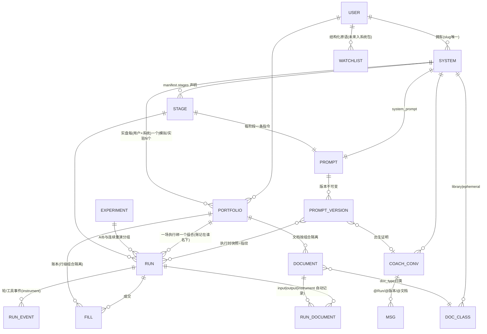

# 工作台架构(定稿 v1.1)

> 2026-08-20 讨论定稿;v1.1 同日修订:bags→**portfolios(组合)** 定名、ref_id 删除、type 三值。
> 上游: [VISION.md](../VISION.md)(为什么);本文(是什么)。
> 状态: **P0 已实施**(2026-08-20,迁移脚本 scripts/migrate_p0.py,77 测试通过);P1–P5 待做(见 §6)。原型: 9 画面静态 mock(讨论用,不随库)。

## 0. 一句话

**用户的世界只有:指令 + 工具 + 文档。**
**平台的世界多两样用户看不见的东西:时钟和组合。**

所有具体说法(实盘/模拟/回放/实验室/履历)都是这两样东西的组合产物,不是独立概念。
("账户"一词专属未来的券商户,见 §3 券商通道。)

## 1. 两根隐形轴:时钟 × 组合

| | **实盘组合 main** | **模拟/实验组合 paper·experiment** |
|---|---|---|
| **实时时钟** | 实盘值守(▶运行默认) | **模拟组合**(虚拟资金连续跑,冷启动验证路径) |
| **模拟时钟@某日** | ❌ 禁格(污染履历+作弊) | **实验组合**(某日重演/A-B/验证改动) |

硬规则(平台机械执行,不靠 prompt 自律):

1. **一场执行绑定一个时钟 + 一个组合**,发起时由平台绑定,agent 不可选
2. 一切工具输出、文档读取**截断到时钟**(防未来函数)
3. 一切成交**只写绑定的组合**(实盘组合永不被模拟触碰)
4. 模拟时钟 ⇒ 强制实验组合(禁格在产品上不可选)

旧概念退役:`live`/`replay` 从阶段名和 runs.kind 的语义里退役——
replay = 「模拟时钟 + 实验组合」的俗称;`runs.kind` 变为推导字段(见 §3 Run)。

## 2. 实体关系图(重构后)



分层视角:

```
用户 ─ 拥有 ──→ 系统(manifest = 纯数据声明)
                 ├─ 指令: stages → prompts → prompt_versions(不可变,有出生证明)
                 ├─ 文档类别: doc_classes(library / ephemeral)
                 ├─ 工具白名单
                 └─ 组合: 实盘(成绩单) + 模拟/实验(草稿纸)

执行 = 系统×阶段 + [平台绑定: 时钟 + 组合]
场次(Run) = 证据容器: 输入(读了什么) / 过程(轮+事件) / 产出(写了什么)
   ├─ 实盘组合上的场次流 ──聚合──→ 履历(净值曲线,点击归因)
   └─ 模拟/实验组合上的场次 ──视图──→ 模拟实验室

文档(DOCUMENT): library 跨天存活(住工作台文档区"按类型")
               ephemeral 绑场次(户口在场次,"按日期"只是索引)
```

**读图指南:两个世界,一座桥**

```
定义世界(是什么)               核算世界(钱和知识在哪)
┌──────────────────┐         ┌────────────────────────┐
│ systems 打法      │         │ portfolios 组合          │
│   ├ prompts 指令   │         │   ├ wallets 现金/positions 持仓│
│   │   └ versions  │         │   ├ documents 知识/产出   │
│   └ doc_classes   │         │   ├ watchlists + members │
└─────────┬──────────┘         │   └ versions 版本史      │
          │                    └───────────┬────────────┘
          └───────────┐      ┌─────────────┘
                      ▼      ▼
   users ─(执行者)──► ┌──────────┐     ┌───────────────┐
                      │  runs 桥  │────►│ run_events    │
                      │          │────►│ run_documents │→documents
                      └────┬─────┘     └───────────────┘
                           └──► fills(portfolio_id 记账 + run_id 归因)
```

三条规则:①runs 是**唯一**同时连两个世界的表——发起执行=桥上落一行 ②每个枢纽只挂一种东西:指令挂 systems、钱和知识挂 portfolios、过程挂 runs ③fills 唯一双归属:钱按组合算,行为按场次算。users 出现三次:归属/主人/执行者(独立事实)。

## 3. 实体定义

### System(systems 表,**P0 列名标准化**)
- **P0 重命名对齐三层身份**:`name`→`slug`(机器名,英文唯一键);`display_name` 从 manifest JSON **上提为独立列**(与 prompts 同构:id/slug/display_name)
- `status`(active/archived)
- manifest 字段:`system_prompt`、`stages{}`、`tools[]`、`web_search`
- **新增**:`doc_classes: {library: [...], ephemeral: [...]}`
- **退役**:stage 级 `data_mode`/`clock`(现有 manifest 里 live/replay 阶段的这两个字段移除,时钟改为发起时绑定;`window/skip_lunch/interval` 保留,归执行器按时钟解释)
- 未来(缓办):`schedules`(定时触发)、种子数据打包(系统包,售卖/模板用)
- API 兼容:路径参数 `/systems/{name}/` 语义即 slug,边界解析不变

### Stage(manifest 内嵌,不是表)
- `name/label`、`kind: single|loop`、`prompt`(指向 prompt slug)、工具白名单(可覆盖系统级)、`vars`
- 可选声明(增强,非必需):`inputs/outputs` doc_type 列表——声明了则场次详情标注更准,未声明靠 instrument 自动检测实际读写

### Prompt / PromptVersion(**拆为两表,P0 迁移**)
- **三层身份**(GitHub repo 模式):`id`(代理键,join 用) / `slug`(机器名,`[a-z0-9_-]`,不可变,manifest 引用它) / `display_name`(显示名,可中文、可随时改)
- **prompts 身份表**(新建):id, **system_id FK→systems.id**(代理键关联,user 由链推导,不做文字外键), slug, display_name, created_at;`UNIQUE(system_id, slug)`
- **prompt_versions 内容表**:prompt_id FK,`(prompt_id, version)` 唯一,content/sha256 不可变
- 命名空间 = **(system, slug)**——同用户两个系统各有 premarket,互不相干(现状键缺 system 级,会串版本流,必须修);user 经 systems.user_id 推导,子表不挂 user_id
- 用户级 prompt(如 `_coach` 教练风格):`system_id=NULL` 命名空间
- 版本 meta:出生证明(来源会话/实验 id、变更摘要),UI 挂在版本时间线
- run 封面仍存 `{slug: 版本}` 快照(指纹),保证任何场次可精确重放当时指令

### Portfolio(portfolios 表,**P0 由 bags 重命名并与 ledgers 合并**)= 组合
> 用户层一律称**组合**:实盘组合(main)/模拟组合(paper)/实验组合(experiment)。旧 ledgers("账本")退役,name 与 live/paper 并入本表。**"账户"一词专属未来券商户**。

迁移对照(旧两类 kind 拼出新 type,1:1 零歧义):

| 旧 bags.kind | 旧 ledgers.kind | 新 type | 中文 |
|---|---|---|---|
| persistent | live | `main` | 实盘组合(每用户×系统恰一个,净值=履历) |
| persistent | paper | `paper` | 模拟组合(跨天虚拟资金) |
| ephemeral(无 ledgers 行) | — | `experiment` | 实验组合(一次性,跑完归档) |

结构(**顶层表,无任何向下层指的列**):

```
portfolios
  id                  PK
  owner_user          ← 谁
  system_id     → systems.id   ← 哪个系统的
  name                显示名('主组合'/'实验-0819',可空;ephemeral 历史无名的留空)
  type                main | paper | experiment
  broker_account_id   预留(现全 NULL=虚拟),见券商通道
  created_at
```

- **ref_id 删除**(P0):组合:场次 = 1:N,指针在"多"的一侧(`runs.portfolio_id`);"这个组合被哪些场用了"反查即可;旧 ref_id 与其互为冗余逆指针,正是孤儿(bag 2)的来源
- 实验组合与实验的关联经 `runs.experiment_id`(P3)表达——连续重演多日 = 一个实验 N 场共享一个实验组合
- 部分唯一索引:`UNIQUE(owner_user, system_id) WHERE type='main'`(实盘恰一个,数据库兜底)
- 实验组合三模式保留(原 bag.py):`fresh`(初始资金+知识从实盘复制)/ `fork`(复制实盘现状)/ `fork-as-of D`(流水折叠)
- 数据卫生:删场次时回收孤儿实验组合;user 3 的 200+ 测试账本与 guard-* 系统待清理

### 券商通道扩展(预留设计,不实现)
**原则:组合是核算层,券商账户只是通道+托管层。** 履历/证据链/防重复全部依赖内部账本,不依赖券商——模拟与实盘同一套核算代码,券商挂了或换券商,履历不丢。

```
broker_accounts(券商户,用户级资产)
  id, user_id, broker_name, 通道类型(miniQMT/QMT/PTrade/API), 凭证(加密), status

portfolios.broker_account_id → broker_accounts.id   ← 预留列,现全 NULL
```

- **执行通道可插拔**:execute 工具现在=内部账本直记(虚拟模式);未来=通道适配器(每券商一个:下单/查回报/查资金),回报回来**同时记内部账本**——账本永远有全量证据
- 一个券商户的资金可对应多个组合(平台内分账:两个系统的实盘各算各的)——N:1,故外键在组合侧
- 实盘开通护栏(未来):per-portfolio 开关 + 风控限额(最大仓位/单日限额)+ 人工确认首次开通

### 共享/市场扩展(预留设计,不实现)
场景:B 用户运行 A 的系统(像自己的系统一样)。骨架已预埋,无需改表:

| 层 | 依托的设计 |
|---|---|
| B 读 A 的指令并自动跟随更新 | prompts 挂 system_id(订阅语义:A 发 v13→B 自动用) |
| B 的钱与净值独立 | 组合挂 (owner_user, system_id)——B 得到自己的实盘/模拟/实验组合 |
| B 的执行可归因 | runs.user_id(执行者) 与 system_id(归属) 本就是两个独立事实 |
| B 能否使用 | grants 授权表(§3 租户链预留):A 授 B runner 角色 |
| 知识种子 | **系统包**:manifest+prompts+模板自选组/库文档 → 首次运行实例化进 B 的组合(VISION ③,缓办) |
| 市场页业绩 | 系统公开履历 = **作者自己实盘组合的净值**(卖作者的成绩单);买家业绩归买家 |

商品档位(届时拍板):订阅制(引用,跟随更新,不可改) / 买断制(复制成自己的系统,可魔改,断更)。

### Run(runs 表,字段增删)
- 现有保留:`user_id/stage/name/trade_date/status/metrics/prompt_versions/bag_id(→portfolio_id)/created_at`
- `system`(文字列)→ **`system_id`**(P0 过渡:先并存回填,API 的 ?system= 过滤参数不变)
- **新增**:`clock('real'|'simulated')` + `clock_date`(重演目标日)
- 一场执行的完整身份五元组:`system_id`(哪个系统)×`stage`(哪个阶段)×`user_id`(谁跑的)×`clock`(什么时钟)×`portfolio_id`(账记在哪个组合)
- **语义降级**:`kind` 变推导字段——live = clock:real + type:main;replay = clock:simulated + type:experiment;single 由 stage.kind 推导。保留列做兼容,回填后不再手写
- 场次 = 证据容器,详情三段:输入(prompt 版本快照/读了哪些文档/自选组)·过程(轮日志+run_events 思考流)·产出(成交/写出的文档)

### Document(documents 表,保留;归类新增)
- `doc_type/bag_id(→portfolio_id)/trade_date/content/meta` 不变;**`ref_id` 退役**(模糊通用引用位,由下方关联表取代)
- 归类由系统 manifest 的 doc_classes 声明:library(预期库/research/教训本…跨天,进工作台文档区"按类型")/ ephemeral(预案/复盘/轮日志…挂场次,"按日期"索引)
- **户口与索引分离**:ephemeral 的户口在产出它的场次(不可变证据);按日期浏览只是索引,点开回到场次

### RunDocument(**新增中间表,P2**)—— 场次↔文档 的显式 N:M
> 场次读/写了哪些文档——现状靠 trade_date+doc_type+name 约定拼接(隐式、脆弱),显式化后成为"输入/过程/产出三段"与"文档被谁引用"的数据底座。

```
run_documents: run_id→runs.id, document_id→documents.id,
               relation(input|output), round, created_at
UNIQUE(run_id, document_id, relation)
```

- **记录成本零**:instrument 已包裹全部工具,get_doc/save_doc 调用时自动插行,无需 agent 配合
- prompt↔文档的"引用关系"**不建表**:指令里的逻辑引用运行时落为工具调用→本表;prompt 页"这条指令通常读什么"从本表聚合派生

### Watchlist(watchlists 表,保留)
- 唯一结构化原语(成员/角色分级/as_of 重建);现归属 user;未来进"系统包"作种子数据

### 唯一键与命名规范(全表红线)
四条规则:①**唯一性跟着所有权链走**(链到哪级,哪级进键) ②**全局唯一只给真正全局的名字**(users.email、未来市场公开 slug) ③**代理键 id 做关联,slug 只做外部引用;外键永远放在"多"的一侧** ④**唯一约束必须落在行上**(约束/RLS 都吃行上列,走中间表做不出约束)

| 表 | 唯一键 | 状态 |
|---|---|---|
| systems | (user_id, slug) | ❌ P0:name→slug 重命名 + display_name 上提为列 |
| prompts | (system_id, slug) | ❌ P0 新建(system_id 外键,user 由链推导) |
| prompt_versions | (prompt_id, version) | ❌ P0 迁移(现为 (user_id,name,version),缺 system 级) |
| portfolios | UNIQUE(owner_user, system_id) WHERE type='main' | ❌ P0 新建(部分唯一索引) |
| runs | (user_id, slug) | ❌ P0:name→slug(生成的机器名,语义不变) |
| documents | (portfolio_id, doc_type, name/trade_date) | ✅ 组合隔离天然带租户 |
| watchlists | (bag_id→portfolio_id, name) | ✅ 组合内唯一(bag_id=0 即实盘知识域;user_id 为兼容列) |

**user_id 保留原则**:"所有权"列跟链走(子表挂 system_id,推导即可);"行为/持有"列留行上——`runs.user_id`=**执行者**(市场阶段 buyer 跑 seller 系统,执行者≠系统主人,且是 RLS/审计热路径)、`portfolios.owner_user`=**组合主人**(钱是用户的)、`watchlists.user_id`=用户级数据。

列名约定:`id` 代理键 / `slug` 机器名 / `display_name` 显示名;**`name` 不得用于键位——存量键位列 P0 统一重命名**(systems.name/runs.name→slug);`fills`/`positions` 的 name 是股票显示名、`documents`/`watchlists` 的 name 是自然名(不被 URL 寻址,保留);**外键一律用代理键 id,不用文字名;顶层表不得有指向下层的列**。

### 租户链与关联方式
```
user ── system(子表挂 system_id 外键) ── prompts + prompt_versions(user 由链推导,不挂 user_id)
user ── portfolio(owner_user + system_id) ── documents/fills(行级隔离,无 user_id)
runs: system_id(跑的哪个系统) + user_id(谁跑的) + portfolio_id(账记谁名下)——三个独立事实
```
- **组合是隔离单位**;(user,system) 决定实盘组合;documents/fills 靠 portfolio_id,不带 user_id
- runs 三列非冗余——市场阶段三者可分属不同人;亦是热路径直列
- **不引入统一关联中间表**:单主人阶段,行上直列的唯一键/约束/RLS 天然成立;共享/市场(VISION ③④)到来时在边缘加 `grants(principal_type, principal_id, resource_type, resource_id, role)` 授权表——所有权不动,现有查询零改动

### Experiment(新增,轻量)
- runs 的分组元数据(共享 experiment_id + 对照说明),支撑 A/B 卡片、连续重演、以及"版本出生证明"的验证链接;无独立表亦可(runs 加 experiment_id 列)

### Coach(documents: doc_type='coach',保留)
- 每系统多会话、@ 引用(场次/指令版本/文档)、建议→一键存新版本、(P5)触发实验按钮
- 克制条款(VISION):教练可自由在实验/模拟组合上发起验证;碰实盘组合必须人来按 ▶

## 4. 平台词汇表(验收红线)

| 平台认识 | 平台**永不**认识(出现在 core/ = 泄漏) |
|---|---|
| stage / clock / portfolio / doc_class / library / ephemeral / run / fill / watchlist / prompt_version | ~~live、replay、预期、预案、复盘、收盘、打板…~~ |

> 实现层退役词(P0 清除):bag / bags / bag_id / ledgers / 账本。
> 注:engine 的执行器知道"实时 loop 在时钟过 15:00 后收工"——这是**时钟**行为,不是"live 阶段"行为;模拟时钟走完当日同样成立。

## 5. UI 结构(对应原型 9 画面)

- **资产视图**(默认落地):值守状态条(实盘组合有实时 loop 场次在跑)+ 指标带 + 实盘净值曲线(点归因)+ 今日卡片;冷启动无实盘历史→曲线自动落模拟组合
- **工作台**(下钻):类型化左栏 📜指令/⭐数据/📚文档——**树 = manifest 的投影**
  - 指令台:内容 + 版本时间线(出生证明)+ 执行史(每版跑过哪些场次/结果)+ 引用关系
  - 文档区:按类型(知识资产)/按日期(执行流水=日视图)切换
- **场次详情**:输入/过程/产出 三段
- **模拟实验室**:模拟/实验组合上执行的视图(重演实验/模拟组合)+ 统一发起入口
- **发起执行**(唯一对话框):选阶段 + 何时(现在/重演某日) + 版本(可钉) + 组合(随时钟自动绑定)

## 6. 实施切片(每片独立上线,旧页可用到新页完工)

| 切片 | 内容 | 性质 |
|---|---|---|
| **P0 地基** | ①bags→portfolios 重命名:全库 bag_id→portfolio_id、bag.py→portfolios.py、**ledgers 合并并入后退役**、ref_id 删除 ②portfolios 加 type(main/paper/experiment 三值)/system_id/broker_account_id 预留 + main 部分唯一索引 ③prompt 拆两表+三层身份+(system_id,slug) 命名空间 ④runs 加 clock/clock_date + system_id(kind 回填转推导)+name→slug ⑤systems.name→slug + display_name 上提为列 ⑥manifest 退役 stage 级 data_mode/clock、加 doc_classes ⑦数据卫生(孤儿实验组合回收、user 3 测试数据清理) | 纯后端,一次迁移,测试护栏全绿即收 |
| **P1 履历** | 净值曲线 API(组合账本聚合)+ 资产视图 v1 | 纯新增页,第一个可见价值 |
| **P2 场次** | **run_documents 中间表**(instrument 自动记录场次↔文档读写)+ RunDetail 重构三段(输入=run_documents+指纹/过程=轮+事件/产出=run_documents+fills) | 改造 |
| **P3 发起** | 统一启动器(何时+组合);任意阶段可重演;版本钉住;实验室视图;replay 阶段退役 | 能力补齐 |
| **P4 工作台** | 类型化左栏(指令台/文档区);阶段导航退役 | 唯一"替换"步,放最后 |
| **P5 教练** | 「跑一次试试」按钮 + 版本出生证明 | 增强 |

缓办(已决):调度器(先手动跑)、系统包/市场(VISION ③)、多日连续回测、AI 读旧会话。

## 7. 现有代码映射

| 模块 | 处置 |
|---|---|
| core/engine.py(manifest 装配/loop/容错/停止) | 保留;时钟参数化(从 manifest 声明改为 run 绑定) |
| core/bag.py | 重命名 portfolios.py;三模式/知识复制/指纹保留;ref_id 相关删除 |
| core/ledger.py | 行级隔离机制保留;列名随 bag_id→portfolio_id;ledgers 登记并入 portfolios;execute 未来接通道适配器(现虚拟模式不动);操作现金的 Account 类建议改名 Wallet |
| core/market.py(双模+时间截断) | 保留;统一为"时间参数 + 时钟截断" |
| core/runs.py | +clock 字段;kind 转推导;bag_id→portfolio_id;name→slug |
| core/systems.py | name→slug、display_name 上提为列;manifest 清 stage 级 data_mode/clock、加 doc_classes |
| core/promptver.py | 拆两表:prompts 身份表(含 slug/display_name)+ versions 按 prompt_id;调用方随 _prompt_cover 传 system |
| core/events.py + instrument | 保留(输入/产出自动检测的数据源) |
| core/documents.py / watchlist.py | 保留;doc_classes 归类在读取层应用;bag_id→portfolio_id |
| web 阶段工作台 | P4 前不动,P4 重排 |

## 8. 表字段说明(全库定稿)

> 状态标记:**[现状]** 现有保留 / **[P0]** 本次迁移 / **[退役]** P0 清除 / **[未来]** 预留不建。
> 通用约定:金额一律 `*_cents` 整数分(杜绝浮点);时间戳 TEXT 存 ISO 本地时间。

### 身份域(core/identity.py)

**users [现状]** —— 人

| 字段 | 类型 | 说明 |
|---|---|---|
| id | INTEGER PK | 代理键 |
| email | TEXT UNIQUE | 全局唯一(真正全局的名字) |
| display_name | TEXT | 显示名 |
| is_admin | BOOLEAN | 管理员(live 账本内测仅管理员) |
| created_at | TEXT | |

**identities / sessions / api_keys [现状]** —— 登录凭据/会话/API Key:均为 user_id→users.id 的子表,凭据只存哈希(credential_hash/token_hash/key_hash),含过期与吊销(expires_at/revoked_at)。与交易模型无耦合,不展开。

### 系统域

**systems [P0:name→slug 重命名 + display_name 上提]** —— 交易系统定义正本

| 字段 | 类型 | 说明 |
|---|---|---|
| id | INTEGER PK | 代理键;子表(systems 维度)一律引用它 |
| user_id | INTEGER | 归属用户 |
| slug | TEXT | 机器名,英文唯一键(原 name 列重命名) |
| display_name | TEXT | 显示名,可中文(从 manifest JSON 上提为列) |
| manifest | JSONB | 纯数据声明:system_prompt/stages{}/tools[]/web_search/**doc_classes(P0 新增)** |
| status | TEXT | active \| archived |
| created_at / updated_at | TEXT | |

唯一键:`UNIQUE(user_id, slug)`。

### 指令域

**prompts [P0 新建]** —— 指令身份(id/slug/display_name 三层)

| 字段 | 类型 | 说明 |
|---|---|---|
| id | INTEGER PK | 代理键 |
| system_id | INTEGER FK→systems.id | **NULL=用户级指令**(如 _coach 教练风格) |
| slug | TEXT | 机器名,不可变;manifest.stages[].prompt 引用它 |
| display_name | TEXT | 显示名,可中文可随时改 |
| created_at | TEXT | |

唯一键:`UNIQUE(system_id, slug)`(NULL 系统级各别处理)。

**prompt_versions [P0 迁移]** —— 指令内容,不可变

| 字段 | 类型 | 说明 |
|---|---|---|
| id | INTEGER PK | |
| prompt_id | INTEGER FK→prompts.id | P0 由 (user_id,name) 改挂本列 |
| version | INTEGER | 单调递增,同 hash 不重复入库 |
| content | TEXT | 全文 |
| sha256 | TEXT | 内容指纹(去重依据) |
| meta | JSONB | P0 新增:出生证明(来源会话/实验 id、变更摘要) |
| created_at | TEXT | |

唯一键:`UNIQUE(prompt_id, version)`。现状列 user_id/name 迁移后退役。

### 组合域(钱与核算)

**portfolios [P0:由 bags 重命名 + 并入 ledgers]** —— 组合(核算单元)

| 字段 | 类型 | 说明 |
|---|---|---|
| id | INTEGER PK | 沿用 bags.id,历史行不动 |
| owner_user | INTEGER | 组合主人(钱是用户的) |
| system_id | INTEGER FK→systems.id | 哪个系统的组合 |
| name | TEXT | 显示名,可空(来自 ledgers.name) |
| type | TEXT | main(实盘) \| paper(模拟) \| experiment(实验) |
| broker_account_id | INTEGER | [未来]FK→broker_accounts.id,现全 NULL=虚拟核算 |
| created_at | TEXT | |

唯一键:`UNIQUE(owner_user, system_id) WHERE type='main'`(实盘恰一个,DB 兜底)。
退役列:kind(persistent/ephemeral)、ref_id(与 runs.portfolio_id 冗余的逆指针)。

**ledgers [退役]** —— id/user_id/name/kind(live|paper)/bag_id/created_at;name 与 kind 按迁移对照表(§3)并入 portfolios 后删表。

**wallets [现状,列名随迁]** —— 每组合一行现金

| 字段 | 类型 | 说明 |
|---|---|---|
| bag_id→portfolio_id | INTEGER PK | 一组合一行 |
| cash_cents | INTEGER | 当前现金 |
| initial_cents | INTEGER | 初始资金(净值分母) |

**positions [现状,列名随迁]** —— 持仓

| 字段 | 类型 | 说明 |
|---|---|---|
| code / name | TEXT | 股票代码/名称 |
| quantity / sellable | INTEGER | 总量 / T+1 可卖量 |
| avg_cost_cents | INTEGER | 摊薄成本 |
| bought_on | TEXT | 最近买入日(T+1 依据) |
| bag_id→portfolio_id | INTEGER | 行级隔离 |

**fills [现状,列名随迁]** —— 成交流水(证据链的账目侧)

| 字段 | 类型 | 说明 |
|---|---|---|
| id | INTEGER PK | |
| code / name / side | TEXT | BUY\|SELL |
| quantity / price_cents | INTEGER | 数量/成交价 |
| cash_before/after_cents | INTEGER | 记账前后现金快照(审计) |
| position_before/after | INTEGER | 记账前后持仓快照 |
| reason | TEXT | **决策理由全文留痕**(买入/卖出逻辑) |
| trade_time / created_at | TEXT | 成交时刻/记录时刻 |
| bag_id→portfolio_id | INTEGER | **记账归属,必填**(主人是组合:期初建仓/出入金/对账流水无 run 也成立;净值曲线=按本列聚合) |
| run_id | INTEGER | **行为归因,可空**(哪场下的单;历史/非执行流水无此项) |

### 场次域

**runs [P0 加列]** —— 场次=一次执行=证据容器

| 字段 | 类型 | 说明 |
|---|---|---|
| id | INTEGER PK | |
| user_id | INTEGER | **执行者**(≠系统主人,市场阶段两者可分属) |
| system | TEXT | 文字列,P0 并存 system_id 后逐步退役 |
| system_id | INTEGER FK | [P0]跑的哪个系统 |
| stage | TEXT | 哪个阶段 |
| slug | TEXT | 生成的机器名(如 20260820-live);UNIQUE(user_id,slug);P0 由 name 重命名 |
| kind | TEXT | live\|replay;**P0 起为推导字段**,不再手写 |
| clock / clock_date | TEXT | [P0]real\|simulated / 重演目标日 |
| portfolio_id | INTEGER FK | 账记在哪个组合(bag_id 改名) |
| trade_date | TEXT | 交易日 |
| status | TEXT | running/stopping/sealed/failed |
| prompt_versions | TEXT(JSON) | **指纹**:本场使用的 {slug:版本} 快照,可精确重放 |
| metrics | JSONB | 封面指标(收益/回撤等) |
| fingerprint | TEXT | 组合指纹(开局状态哈希) |
| experiment_id | INTEGER | [P3]A/B 与连续重演分组 |
| schema_name | TEXT | 旧 PG schema 回放遗留,P0 可清 |
| created_at / sealed_at | TEXT | |

**run_events [现状]** —— 实时事件流(observability)

| 字段 | 类型 | 说明 |
|---|---|---|
| id / run_id / round | INTEGER | 归属场次与轮次;INDEX(run_id,round) |
| kind | TEXT | round_start/round_end/tool_call/tool_return… |
| tool / body | TEXT | 工具名/事件内容 |
| created_at | TEXT | |

**run_documents [P2 新增]** —— 场次↔文档 显式关联(证据链底座)

| 字段 | 类型 | 说明 |
|---|---|---|
| id | INTEGER PK | |
| run_id | INTEGER FK→runs.id | 哪场 |
| document_id | INTEGER FK→documents.id | 哪个文档 |
| relation | TEXT | input(读) \| output(写) |
| round | INTEGER | 哪一轮 |
| created_at | TEXT | |

唯一键:`UNIQUE(run_id, document_id, relation)`;由 instrument 在 get_doc/save_doc 工具调用时自动记录。

### 文档域

**documents [现状,列名随迁]** —— 万物记忆(知识+产出+教练对话)

| 字段 | 类型 | 说明 |
|---|---|---|
| id | INTEGER PK | |
| doc_type | TEXT | expectation/premarket/close/research/watch_*/transcript_*/coach…;归属由 manifest doc_classes 声明 |
| name | TEXT | 同类型内名称(如预案名 r226) |
| trade_date | TEXT | 绑交易日;INDEX(doc_type,trade_date) |
| ref_id | INTEGER | ~~通用引用位~~ **退役**(由 run_documents 取代) |
| content | TEXT | 全文 |
| meta | JSONB | stage/status 等元数据 |
| bag_id→portfolio_id | INTEGER | 行级隔离(实验组合=知识副本) |
| created_at / updated_at | TEXT | |

**versions [现状,列名随迁]** —— 通用版本史(审计)

| 字段 | 类型 | 说明 |
|---|---|---|
| subject_type / subject_id | TEXT | 任意主体(文档/自选组…) |
| action / payload | TEXT/JSONB | 动作与内容快照 |
| ts / bag_id→portfolio_id | | INDEX(subject_type,subject_id) |

**watchlists / watchlist_members [现状,列名随迁]** —— 唯一结构化原语

| 表.字段 | 说明 |
|---|---|
| watchlists(bag_id→portfolio_id, name) | 组合内唯一;bag_id=0 即实盘知识域;user_id 为兼容列 |
| watchlist_members(bag_id, list_name, code) | 成员;UNIQUE 三列;fields JSONB 存角色分级(leader 等) |

### 未来预留(不建表,仅设计)

**broker_accounts**:id, user_id, broker_name, channel_type(miniQMT/QMT/PTrade/API), credentials(加密), status——券商户,绑用户;"账户"一词专属它。
**grants**:principal_type/principal_id, resource_type/resource_id, role——市场阶段的授权表,所有权不动。
