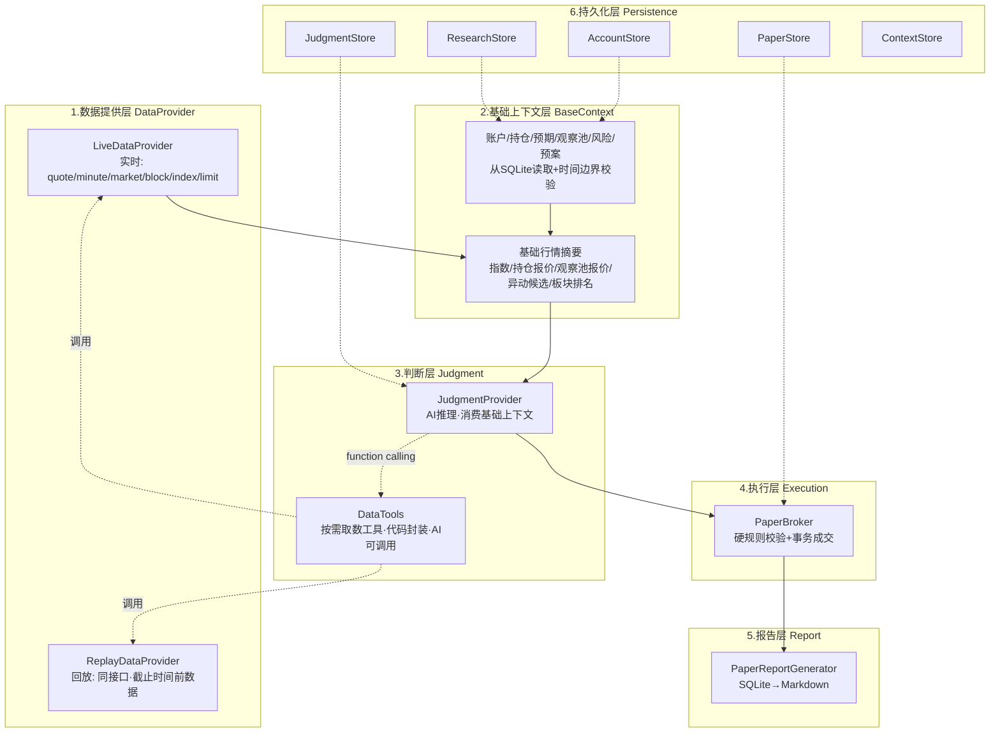

# Trading Engine

> 独立的实时优先 AI 交易引擎，用确定性回放做回归测试。

## 一、定位

把旧 `skills/trading-system`（基于 Markdown 的 AI 工作流）重构成**代码化、可测试、可审计**的独立 Agent。

核心分工：**AI 负责市场理解和交易判断，代码负责数据边界、状态、硬约束、执行和持久化。** AI 全程碰不到钱和持仓，只产出结构化提案，代码层做规则校验后才能成交。

与旧 Skill 完全独立：不读取、不写入、也不要求存在旧 Skill 文件。旧 Skill 仅作为设计阶段的规则参考。

## 二、核心设计原则

1. 真实看盘是产品主线；历史回放是开发和回归测试基座。
2. 每个 Phase 都必须能够独立运行、测试和验收。
3. 只通过 `astock` CLI 获取行情，不直接访问 ClickHouse 或 TDX。
4. 模拟回放在任意时点只能使用该时点之前可获得的数据，禁止未来数据泄漏。
5. 先实现普通 Python 节点；节点边界稳定后再引入 LangGraph。
6. SQLite 保存运行状态、账户、订单和决策事件；Markdown 作为面向人的报告。
7. AI 判断先在实时影子模式运行，不修改账户；同一节点必须能够使用历史回放数据测试。

## 三、架构

### 6层分层架构



### 分层职责

| 层 | 职责 | 关键类 |
|----|------|--------|
| 数据提供层 | 封装所有 astock 调用，提供结构化数据接口；实时/回放统一接口 | `LiveDataProvider`, `ReplayDataProvider` |
| 基础上下文层 | 构建快扫级基础上下文，严格时间边界，阻塞检测 | `BaseContextBuilder` |
| 判断层 | AI 消费基础上下文，按需调用 DataTools 取数，产出提案 | `JudgmentProvider`, `DataTools` |
| 执行层 | 硬规则校验，事务性成交，幂等恢复 | `PaperBroker` |
| 报告层 | 从 SQLite 原子生成 Markdown | `PaperReportGenerator` |
| 持久化层 | 全部状态存 SQLite，按职责拆分 | `AccountStore`, `ResearchStore`, `JudgmentStore`, `PaperStore`, `ContextStore` |

### 渐进式取数

AI 判断采用渐进式取数，而非一次性塞满上下文：

```
基础上下文 → AI扫描 → 有信号？
  → 否：WAIT，0次工具调用
  → 是：AI调用DataTools取深析数据（板块成员/分钟K线/涨停明细）→ 深析 → 提案
```

- 第一层（基础上下文）：每次必采，快扫级数据，代码自动构建
- 第二层（DataTools）：AI 按需调用，深析级数据，代码封装+审计记录
- 无信号时 0 次工具调用，有信号时按需调用

### 一条完整链路

```
context capture     analyze context      paper execute       paper report
  采行情+构建上下文 →  消费上下文产提案  →  规则校验+模拟成交  →  生成报告
```

每一步的产出持久化到 SQLite，下一步消费上一步的持久化结果。命令之间不共享内存状态，靠数据库传递。

## 四、CLI 命令

入口：`trader`（注册在 `pyproject.toml` 的 `[project.scripts]`）。

### 完整交易链路（4步）

```bash
# 1. 采行情 + 构建上下文（实时）
trader context capture --account paper

# 1'. 采行情 + 构建上下文（历史回放）
trader context replay --date 20260723 --until 10:30 --account paper

# 2. AI判断（消费最新上下文）
trader analyze latest --account paper

# 3. 规则校验 + 模拟成交
trader paper execute --account paper

# 4. 生成报告
trader paper report --account paper
```

行情数据直接从 astock 读取，保存在 `context_json` 中，不存独立行情表。

### 命令清单

| 命令组 | 命令 | 作用 |
|--------|------|------|
| `config` | `show` | 打印解析后的本地路径 |
| `astock` | `check` | 验证 astock 二进制可用性 |
| `replay` | `start` / `resume` | 启动/恢复历史回放 |
| `status` | - | 查看最新回放运行状态 |
| `context` | `capture` / `replay` / `show` | 采行情+构建上下文 / 回放构建 / 只读展示（支持 `--date`/`--until` 按日期查询） |
| `context reasoning` | `add` / `list` | 追加/列出 LLM 推理链（观察→假设→验证→结论） |
| `context tool-call` | `add` / `list` | 追加/列出 astock 工具调用记录（AI 盘中调用的工具+参数+结果） |
| `analyze` | `latest` / `context` / `show` | 消费最新上下文判断 / 消费指定上下文判断 / 只读展示判断 |
| `brief` | - | 跨资源聚合状态摘要（不预取行情） |
| `account` | `init` / `show` / `update` | 创建/查看/更新独立账户 |
| `position` | `set` / `list` | 设置/列出持仓 |
| `thesis` | `set` / `list` / `link` | 创建/列出(`--active-only`)/关联预期 |
| `pool` | `set` / `member` / `show` / `list` | 创建固定池/添加成员/查看单个/列出全部 |
| `risk` | `set` / `list` / `link` | 创建/列出/关联风险因子 |
| `plan` | `set` / `list` | 创建/列出结构化交易预案 |
| `evidence` | `add` / `list` | 添加/列出催化证据 |
| `paper` | `execute` / `settle` / `orders` / `fills` / `events` / `audit` / `report` / `history` | 模拟交易全流程 |

## 五、执行流程详解

### 第1步：行情采集 + 上下文构建

`trader context capture` 内部做了两件事：

1. `DecisionContextBuilder.required_live_codes()` — 自动合并持仓代码 + 观察池成员代码 + 当日交易预案目标代码
2. `LiveMarketData(include_discovery=True).snapshot()` — 采集这些代码的实时报价，同时采集全主板异动候选、成交额榜、板块榜、6大指数
3. `DecisionContextBuilder.build()` — 将行情与账户/持仓/预期/观察池/风险/证据/历史观察/历史决策/执行历史聚合为一个不可变的 `DecisionContext`

关键约束：
- 每个实体的更新时间不得晚于行情快照时间（`_require_observable`）
- 未来证据直接排除并计数（`excluded_future_evidence_count`）
- 缺预期/缺证据/缺观察点会生成 blockers，`ready_for_judgment=False` 时拒绝进入判断

### 第2步：AI判断

`trader analyze context` 消费最新 `DecisionContext`，喂给 `JudgmentProvider.judge()`，产出 `JudgmentReport`：

```
JudgmentReport
├── provider / model
├── proposals[]（逐股）
│   ├── code, action(BUY/SELL/WAIT/RESEARCH), quantity
│   ├── confidence, reason, evidence
└── limitations[]
```

当前默认用 `ConservativeShadowProvider`（确定性占位）：大幅波动→RESEARCH，其余→WAIT，**不会输出 BUY/SELL**。这是"半成品"的核心缺口——等待接入真实 LLM。

输出校验：snapshot_id、provider/model、股票集合必须与输入一致，否则记为失败，可重试，不破坏原始快照。

### 第3步：规则校验 + 模拟成交

`trader paper execute` 只消费已持久化、通过校验、带完整上下文的判断。对每个 BUY/SELL 提案逐条检查：

| 买入检查 | 卖出检查 |
|---------|---------|
| duplicate_signal（同股同向同日不重复） | duplicate_signal |
| main_board_buy（限主板） | position_exists |
| buy_lot（100股整数倍） | t_plus_one（不超可卖数量） |
| account_cooldown | sell_lot（整手或清仓） |
| tradable_pool（必须是可交易池成员） | |
| new_position_cutoff（14:50后不开新仓） | |
| cash（现金够） | |
| single_position_limit（单股仓位） | |
| gross_exposure_limit（总仓位） | |
| risk_exposure（共同风险因子上限） | |

任何一条不过 → rejected，记录原因，不成交。整批执行包在 `BEGIN IMMEDIATE` 事务里，`(账户, 判断)` 唯一约束保证中断恢复后不重复成交。

### 第4步：报告生成

`trader paper report` 从 SQLite 原子生成三个 Markdown 文件：
- `state.md` — 账户状态 + 持仓表
- `trades.md` — 全量成交记录
- `<date>-shadow.md` — 当日决策事件 + 订单 + 审计问题

## 六、模块结构

```
src/trading_engine/
├── __init__.py            # 版本
├── __main__.py            # python -m trading_engine 入口
├── cli.py                 # Typer CLI 主入口（config/astock/replay/analyze/
│                          #   account/position/thesis/pool/risk/plan/brief）
├── config.py              # 配置加载（repo_root, astock_binary, data_dir）
├── errors.py              # 异常类型
├── protocols.py           # MarketDataProvider / TradingClock / ExecutionBroker 接口
├── astock.py              # astock CLI 封装
├── live.py                # 实时影子数据（LiveMarketData + 市场发现）
├── replay.py              # 历史回放（ReplayClock / ReplayMarketData / ReplayEngine）
├── models.py              # 基础数据模型（快照/报价/判断/账户/持仓/预期/池/风险/预案）
├── context_models.py      # 决策上下文模型（DecisionContext + ReasoningRecord + ToolCallRecord 及全部子结构）
├── context.py             # 上下文构建器（DecisionContextBuilder）
├── context_store.py       # 上下文存储（内容寻址 context_snapshots + 证据 + 推理链 + 工具调用记录）
├── context_cli.py         # context / evidence / reasoning / tool-call 命令组
├── analysis.py            # 只读判断节点（ReadOnlyAnalyzer + ConservativeShadowProvider）
├── brief.py               # BriefGenerator（跨资源聚合状态摘要）
├── paper.py               # 模拟交易经纪人（PaperBroker）
├── paper_models.py        # 模拟交易模型（订单/成交/事件/审计/策略）
├── paper_store.py         # 模拟交易存储
├── paper_reports.py       # Markdown 报告生成
├── paper_cli.py           # paper 命令组
└── storage.py             # 主存储（ReplayStore，SQLite 持久化）
```

## 七、当前进度

| Phase | 名称 | 状态 |
|-------|------|------|
| 0 | 工程骨架 | 已完成 |
| 1 | 可控历史回放 | 已完成 |
| 2 | 实时影子数据 | 已完成 |
| 3 | 只读 AI 判断 | 已完成（除外部 LLM provider 外） |
| 4 | 模拟交易闭环 | 已完成 |
| 5 | 精简重构 | 已完成（删 tools/watch，行情统一走 astock，context 全量留存 + LLM 推理链） |
| 6 | 实时看盘循环 | 未开始 |

### Phase 5 已完成内容

- 删 `tools` 命令族 -- 查询回归资源命令（`account show`/`position list`/`thesis list --active-only`/`pool list`/etc.），保留 `brief`
- 删 `watch` 命令 + `live_snapshots` 表 -- 行情不单独存表，brain 直接调 astock
- 改造 context capture -- 行情从 astock 直读，存入 `context_json`，不存独立行情表
- 改造 analyze -- `ReadOnlyAnalyzer.analyze()` 接收 `DecisionContextRecord`（行情已在 context 内）
- 改造 paper execute -- staleness 检测改为 `_assert_core_context_fresh`（比对当前 SQLite 状态 vs context 捕获时状态）
- 加 LLM reasoning -- `reasoning_records` 表 + `ReasoningRecord` 模型 + `trader context reasoning add/list` 命令
- 默认账户名统一为 "paper"

### 看盘循环完善（Phase 6 准备）

- **A1 证据瘦身** -- 砍掉 `kind=market`（与 astock 行情重复），加 `kind=policy`；最终 KINDS = `{announcement, news, industry, policy, other}`；旧 DB 的 `market` 行迁移为 `other`，旧 `context_json` 中的 `"kind":"market"` 也自动修补
- **A2 池成员 causal_chain** -- `WatchPoolMember` + `PoolMemberSignalContext` 加 `causal_chain: str | None`，CLI `pool member --causal-chain` 设置，`pool show` 展示，context 透传
- **A3 预期 bet_pct** -- `ThesisState` 加 `bet_pct: Decimal | None`（0-100），CLI `thesis set --bet` 设置，`thesis list` 展示，`brief` 输出
- **B1 context show 按日期查询** -- `context show --date 2026-07-28 --until 10:00`，`get_context_by_date()` 方法按上海时区过滤
- **B2 tool_call 记录** -- `tool_call_records` 表 + `ToolCallRecord` 模型 + `context tool-call add/list` 命令，记录 AI 盘中调用的 astock 工具+参数+结果
- **D2 paper history** -- `paper history` 命令聚合 fills+events+orders 的日级摘要

### 已知缺口

1. **外部 LLM Provider 未接入** — `ConservativeShadowProvider` 是占位，只按价格涨跌幅输出 WAIT/RESEARCH，不会输出 BUY/SELL。需要替换为真实 LLM，复用已验证的 Pydantic 契约、重试机制和审计记录。
2. **语义归因与提案** — 异动归因、直接受益池、龙头识别、三维确认、Mode A/B 预期研究的语义判断依赖外部 LLM。结构化输入输出和硬约束已就绪。
3. **连续轮询** — 当前是手动单次 CLI 模式，Phase 6 需要常驻进程实现盘中自动循环。
4. **LangGraph 编排** — 当前是普通 Python 节点，roadmap 计划节点稳定后再引入。

## 八、开发与测试

```bash
# 安装
uv sync

# 运行测试
uv run pytest tests

# 从仓库根目录运行
./trader --version
./trader --help
./trader config show
./trader astock check
```

测试不依赖开盘时间和外部 LLM，使用确定性 provider 和固定夹具。

### 环境变量

| 变量 | 作用 | 默认值 |
|------|------|--------|
| `TRADER_REPO_ROOT` | 仓库根目录 | 自动发现（含 `astock/` 和 `trading_engine/` 的目录） |
| `TRADER_ASTOCK_BINARY` | astock 二进制路径 | `<repo_root>/astock/astock` |
| `TRADER_DATA_DIR` | 数据目录 | `<repo_root>/trading_engine/data` |
| `TRADER_LLM_PROVIDER` | analyze 的 LLM provider（shadow 或 deepseek） | 空（shadow） |
| `TRADER_LLM_API_KEY` | DeepSeek API key（provider=deepseek 时必填） | 空 |
| `TRADER_LLM_BASE_URL` | DeepSeek API base URL（Anthropic 兼容） | `https://api.deepseek.com/anthropic` |
| `TRADER_LLM_MODEL` | DeepSeek 模型名 | `deepseek-v4-flash` |

### LLM provider

`trader analyze --provider deepseek` 会把当轮 L0 上下文（指数/持仓/强势板块/主题池，约 3KB 文本）发给 DeepSeek，要求其对每只持仓股输出结构化判断（WAIT/RESEARCH/BUY/SELL + 置信度 + 理由 + 证据）。非持仓的主题池成员自动 WAIT。返回的 BUY/SELL 仍须经 `trader paper execute` 的硬规则校验（T+1/主板/整手/风险预算）方可成交。

```bash
export TRADER_LLM_API_KEY=sk-xxx
trader context replay --date 20260807 --until 09:35   # 构建上下文
trader analyze latest --provider deepseek              # DeepSeek 判断
trader paper execute                                    # 规则校验后模拟成交
```

实现见 `src/trading_engine/llm_provider.py`（`DeepSeekProvider`，Anthropic 兼容 API，thinking 关闭 + 容错 JSON 解析）。

### 数据职责

| 数据 | 存储 | 说明 |
|------|------|------|
| 行情 | astock CLI | brain 直接调用；trader 不做行情代理 |
| 运行状态 | SQLite | run / checkpoint / 错误 / 恢复 |
| 独立账户 | SQLite | 现金 / 持仓 / 上下文基础状态 |
| 订单和成交 | SQLite | 经过规则校验的模拟执行记录 |
| 决策上下文 | SQLite (context_snapshots) | 完整决策快照：行情+状态+证据+历史，冻结去重 |
| LLM 推理链 | SQLite (reasoning_records) | 每轮 context 的观察->假设->验证->结论 |
| 工具调用记录 | SQLite (tool_call_records) | AI 盘中调用的 astock 工具+参数+结果，绑定到 context |
| 决策审计 | SQLite | 输入摘要 / AI提案 / 规则校验 / 执行结果 |
| 研究知识 | SQLite | 预期 / 固定池 / 催化 / 风险因子 |
| 人类可读报告 | Markdown | 从结构化状态生成 |
| 密钥和凭证 | 环境变量 | 禁止写入 SQLite 和 Git |
